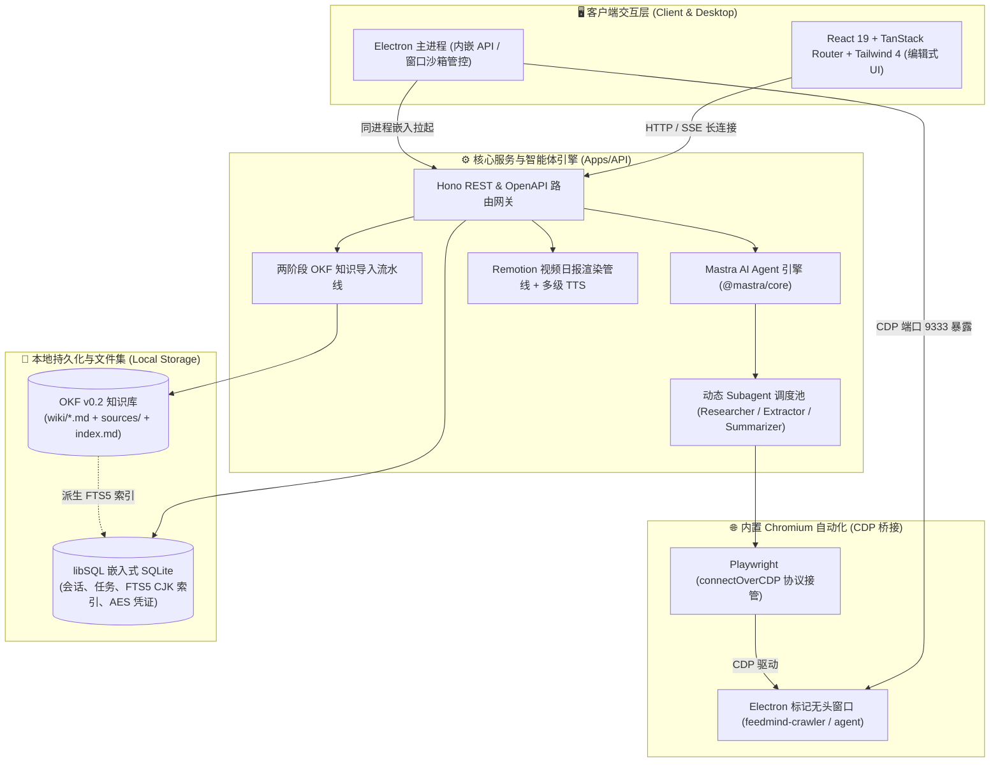

<div align="center">
  
  <h1>FeedMind</h1>
  <p><b>本地优先（Local-first）的趋势研究 AI 智能体与 OKF 知识沉淀系统</b></p>
  <p>打通「多平台情报采集 → 动态 Agent 深度研读 → Google OKF 知识图谱与视频简报沉淀」的生产级全流程闭环。</p>

  <p>
    <a href="https://github.com/flyemFSB/FeedMind/releases"></a>
    
    
    
    
  </p>
</div>

---

> [!IMPORTANT]
>
> ### 🛡️ 真正的本地优先（Local-First）与数据主权
>
> 与依赖云端黑盒存储的传统 AI 工具不同，FeedMind 从底层架构保证用户的数据主权与隐私安全：
>
> 1. **纯文本知识集**：页面为标准 Markdown + YAML Frontmatter（遵循 Google OKF v0.2 规范），天然支持 Git 版本管理与第三方编辑器（Obsidian、VS Code）。
> 2. **派生投影设计**：SQLite FTS5 全文索引与关系图谱纯属派生缓存，可随时从纯文本概念文件毫秒级重建，**无任何专有数据库格式绑定**。
> 3. **零云端凭证泄露**：libSQL 嵌入式本地数据库，API Key 与 Cookie 均通过 **AES-128-CBC + HMAC-SHA256** 本地加密存储。

---

## 🏛️ 系统核心架构拓扑

FeedMind 采用全栈 Monorepo 架构，将 Web UI、Node.js API、Mastra AI Agent、内置 Chromium 与 Electron 桌面端融为一体：



---

## 🔬 深入：生产级架构与关键工程决策

<details open>
<summary><b>1. 📚 OKF v0.2 标准文件型知识引擎与两阶段导入流水线</b></summary>

- **解构传统 RAG 痛点**：传统向量切片存储是黑盒，缺乏上下文且无法人工校验；直接生成 Markdown 则容易破坏全局概念图谱。
- **两阶段 LLM 生成管线（`ingest-pipeline.ts`）**：
  1. **阶段 1（语义结构化）**：多格式文档（PDF / Word / Excel / PPT / 图片，支持 PaddleOCR-VL 视觉模型 API 与本地解析自适应降级）由大模型解构为结构化实体、关键事实与引用片段。
  2. **阶段 2（OKF 概念提炼）**：结合全局上下文一次性输出符合 Google OKF v0.2 规范的概念页面（包含前置概念、双向链接、`sources` 证据链、`generated` 生成信号、`verified` 校验状态）。
- **派生索引与社区发现**：SQLite FTS5 全文索引（支持 CJK 中文分词）和基于 Graphology + Louvain 社区聚类算法的关系图谱均从纯文本概念文件派生，毫秒级检索且支持随时无损重建。

</details>

<details open>
<summary><b>2. 🚀 Electron 内嵌 API + CDP 驱动内置 Chromium（零额外进程）</b></summary>

- **解构传统抓取痛点**：常规方案通过子进程频繁启动独立 Chrome 实例，内存暴涨（2~4GB+）、冷启动缓慢且易被反爬指纹识别。
- **端口复用与双标记沙箱（`main.ts`）**：
  - Electron 主进程内嵌 Node.js API，启动时开启 `--remote-debugging-port`。
  - 创建专用的隐藏标记窗口（`feedmind-crawler` 与 `feedmind-agent`），注入真实 Chrome 用户指纹（UA、WebRTC、Canvas）。
  - 爬虫核心与 Mastra Agent 通过 `connectOverCDP` 直接连接内置 Chromium，**内存占用降低 60% 以上，无任何外部浏览器进程弹出**。
- **主动内存熔断与安全边界**：
  - 内置内存采样监控，当标记窗口 WorkingSet 超过 1024MB 时主动销毁并重建，根治 Chromium 长期运行的内存泄漏。
  - 连接时严格校验 Client UA 包含 Electron，**物理拒绝连接驱动用户的操作系统默认浏览器**。

</details>

<details>
<summary><b>3. 🕷️ 模块化多平台自适应抓取与 Cookie 自动保活</b></summary>

- **双模式自适应降级**：
  - ⚡ **Fast Path**：存在有效 Cookie 时优先走逆向 HTTP API 直连，毫秒级响应、高并发。
  - 🛡️ **Fallback Path**：遇到验证码、风控或无 Cookie 时，自动无缝降级至应用内置 Chromium 浏览器自动化抓取。
- **Cookie 智能同步与保活**：支持 CookieCloud 协议一键注入浏览器登录态；针对微信读书（WeRead）等平台，内置后台保活协程（每 30 分钟自动刷新 `skey` 鉴权票据）。
- **统一 RSS 2.0 规范投影**：多源提取封面图（Media RSS 命名空间 → enclosure 附件 → iTunes 播客封面 → 顶层 image 字段），统一输出标准 RSS 2.0 XML。

</details>

<details>
<summary><b>4. 🔐 企业级安全边界与主动防御体系</b></summary>

- **全链路 SSRF 防御（`checkSSRF`）**：所有外部 URL 在抓取或解析前，强制执行 DNS 解析并校验 IP 白名单，严格拦截私有网段（`10.0.0.0/8`、`172.16.0.0/12`、`192.168.0.0/16`）、环回（`127.0.0.1`）、链路本地与云元数据地址（`169.254.169.254`）。
- **分层加密与日志自动脱敏**：
  - 敏感凭证采用 AES-128-CBC + HMAC-SHA256 本地加密落库。
  - Pino 结构化日志全局自动过滤 `apiKey`、`password`、`cookies`、`authorization` 等敏感字段。
- **内存溢出与 Payload 防御**：Hono 全局 25MB BodyLimit，拦截超大请求导致的事件循环阻塞与 OOM。

</details>

<details>
<summary><b>5. 🎬 基于 Remotion 的代码化视频日报流水线</b></summary>

- **确定性声明式渲染**：从 RSS 趋势聚类 → LLM 提炼分镜脚本 → Remotion React 组件代码化逐帧渲染 1080P 60FPS 视频。
- **多级 TTS 自动降级与时间轴对齐**：Fish Audio 在线合成 → 自动降级 Edge-TTS → 自动降级占位音频与估算时长，精准对齐 `narration.srt` 字幕时间轴，确保视频生成管线永不中断。

</details>

---

## ⚡ 核心功能特性矩阵

| 特性模块                 | 核心能力                                                              | 技术支撑                                       |
| :----------------------- | :-------------------------------------------------------------------- | :--------------------------------------------- |
| **🤖 AI Agent 研究对话** | 多模型运行时热切换、流式思考与工具调用轨迹、动态 Subagent 派发        | Mastra AI, Vercel AI SDK, AnySearch, Firecrawl |
| **📚 OKF Wiki 知识库**   | 纯文本 Markdown 概念、双向反向链接、Graphology 关系图谱、CJK 全文检索 | OKF v0.2, SQLite FTS5, Graphology Louvain      |
| **🕷️ 多平台情报抓取**    | 小红书、Bilibili、知乎、微信读书自适应抓取、CookieCloud 同步、RSS 2.0 | CDP 协议, Playwright, CookieCloud, RSSHub 机制 |
| **🎬 自动化视频日报**    | 趋势热点聚类、AI 分镜脚本编写、多渠道 TTS 旁白合成、代码驱动渲染      | Remotion, React 19, Fish Audio, Edge-TTS       |
| **🔒 本地优先与安全**    | 本地嵌入式存储、AES 加密凭据落库、全链路 SSRF 防御、Pino 日志脱敏     | libSQL, AES-128-CBC, HMAC-SHA256, Pino Logger  |

---

## 🚀 快速上手

### 方式 1：下载桌面端应用（推荐日常使用）

前往 [GitHub Releases](../../releases) 下载最新的 Windows 安装包（`FeedMind-Setup.exe`），一键安装运行，内置 API 与 Chromium 自动化环境自动就绪。

### 方式 2：源码本地开发

```bash
# 1. 克隆仓库并安装依赖 (pnpm workspace)
git clone https://github.com/flyemFSB/FeedMind.git
cd FeedMind

# 2. 配置环境变量
cp .env.example .env
# 编辑 .env，生成 ENCRYPTION_KEY：
# openssl rand -hex 32

# 3. 安装依赖
pnpm install

# 4. 构建共享包（必须）
pnpm run build:packages

# 5. 初始化数据库
pnpm run db:init
```

### 启动开发服务

```bash
# 同时启动 API 后端和 Web 前端
pnpm run dev
```

访问地址：

| 服务             | 地址                                  | 说明                 |
| ---------------- | ------------------------------------- | -------------------- |
| **Web 应用**     | http://localhost:13790                | Vite + React 前端    |
| **REST API**     | http://localhost:18790                | Hono 后端            |
| **API 文档**     | http://localhost:18790/api/v1/docs    | Scalar UI 交互式文档 |
| **OpenAPI JSON** | http://localhost:18790/api/v1/openapi | 机器可读规范         |

### 桌面应用（Electron）

FeedMind 提供 Windows 桌面端支持：主进程内嵌 API 服务，爬虫与智能体通过 Chrome DevTools Protocol（CDP）连接应用内置 Chromium 实例，无需额外启动独立浏览器。

```bash
# 开发模式：Vite（热更新） + Electron，爬虫经 CDP 连接内置 Chromium
pnpm run desktop:dev

# 生产模式：构建全部产物并直接运行桌面应用（内置 HTTP 服务同源提供 UI 与 API）
pnpm run desktop

# 打包 Windows 安装程序（NSIS）
pnpm --filter @feedmind/desktop dist
```

### 常用命令

```bash
# 单服务开发
pnpm run web:dev   # 仅前端
pnpm run api:dev   # 仅后端

# 构建与测试
pnpm run build          # 构建全部
pnpm run build:packages # 仅构建共享包
pnpm run typecheck      # TypeScript 类型检查
pnpm run lint           # oxlint 代码检查
pnpm run fmt            # oxfmt 代码格式化
pnpm run fmt:check      # oxfmt 格式校验（不写入）
pnpm run test           # Vitest 单元测试

# 数据库管理
pnpm run db:generate    # 生成迁移文件
pnpm run db:migrate     # 运行迁移
pnpm run db:reset       # 重置数据库
```

---

## 📁 项目结构

```
feedmind/
├── apps/                          # 应用程序根目录
│   ├── api/                       # REST API + Mastra Agent
│   │   ├── src/
│   │   │   ├── lib/              # 通用工具（logger、openapi、http）
│   │   │   ├── routes/v1/        # OpenAPI v1 路由组
│   │   │   │   ├── health.ts     # 健康检查
│   │   │   │   ├── chats.ts      # 会话管理
│   │   │   │   ├── llms.ts       # 模型配置
│   │   │   │   ├── wiki.ts       # Wiki 知识库 API
│   │   │   │   ├── crawler.ts    # 爬虫任务
│   │   │   │   ├── tools.ts      # 工具配置
│   │   │   │   ├── skills.ts     # 技能包
│   │   │   │   ├── runtime-config.ts # 运行时配置
│   │   │   │   └── ...
│   │   │   ├── modules/          # 业务模块
│   │   │   │   ├── wiki/         # Wiki 核心逻辑（空间、页面、导入、图谱）
│   │   │   │   ├── crawler/      # 爬虫任务队列
│   │   │   │   ├── chat/         # 聊天逻辑
│   │   │   │   └── remote-connection/ # Cookie 管理
│   │   │   └── mastra/           # AI Agent 定义
│   │   │       ├── agents/       # feedmind-agent 主 agent
│   │   │       ├── tools/        # 工具实现
│   │   │       └── subagents/    # 子 agent 模板
│   │   ├── server.ts             # 入口文件
│   │   └── package.json
│   │
│   └── web/                       # React 19 前端（Vite SPA）
│       ├── src/
│       │   ├── routes/           # TanStack Router 文件路由
│       │   │   ├── wiki.tsx      # Wiki 阅读器
│       │   │   ├── feeds.index.tsx # 资讯首页
│       │   │   └── ...
│       │   ├── router.tsx        # 路由实例
│       │   └── main.tsx          # 入口文件
│       ├── components/            # React 组件
│       │   ├── ai-elements/      # AI 对话组件
│       │   ├── chat/             # 聊天界面
│       │   ├── wiki/             # Wiki 编辑器、图谱、导入
│       │   ├── settings/         # 设置面板
│       │   └── ui/               # shadcn/ui 基础组件
│       ├── lib/                   # 工具库
│       │   ├── api/              # API 客户端
│       │   ├── i18n/             # 国际化
│       │   └── hooks/            # 自定义 hooks
│       └── package.json
│
├── packages/                      # 共享包
│   ├── contracts/                # Zod schema（前后端共享契约）
│   ├── db/                       # Drizzle ORM + SQLite
│   ├── shared/                   # 加密、日期工具
│   ├── env/                      # 环境变量加载
│   ├── crawler-core/             # 爬虫引擎核心
│   │   ├── src/
│   │   │   ├── core/            # 浏览器管理、RSS 构建
│   │   │   └── routes/          # 平台实现（xhs、bili、zhihu...）
│   │   └── package.json
│   └── wiki-core/                # Wiki 文件系统操作
│       ├── src/
│       │   ├── page-store.ts    # 页面 CRUD
│       │   ├── graph.ts         # 图谱构建
│       │   ├── search.ts        # 全文检索
│       │   └── links.ts         # 双向链接解析
│       └── package.json
│
├── data/                          # 数据目录（Git 忽略）
│   ├── feedmind.db               # SQLite 数据库
│   └── wiki/                     # Wiki Markdown 文件
│
├── CLAUDE.md                      # AI 开发规范
├── DESIGN.md                      # 设计系统（色板 / 字体 / 组件 token）
│
├── .gitattributes                 # 行尾策略（强制 LF）
├── lefthook.yml                   # Git hooks 配置（pre-commit + commit-msg）
├── .oxlintrc.json                 # oxlint 配置
├── .oxfmtrc.json                  # oxfmt 配置
├── commitlint.config.mjs          # Commit 规范
├── tsconfig.base.json             # TypeScript 基础配置
├── vitest.config.ts               # 测试配置
└── pnpm-workspace.yaml            # Monorepo 配置
```

---

## 🧰 技术栈

### 前端

| 技术                | 版本   | 用途                    |
| ------------------- | ------ | ----------------------- |
| **React**           | 19     | UI 库                   |
| **Vite**            | 8      | 构建工具 + 开发服务器   |
| **TanStack Router** | latest | 文件路由 + 自动代码分割 |
| **Tailwind CSS**    | 4      | 原子化 CSS              |
| **shadcn/ui**       | latest | 组件库                  |
| **Milkdown Crepe**  | 7.x    | Markdown 所见即得编辑器 |
| **motion**          | latest | 动画                    |
| **Zod**             | 4      | 运行时验证              |
| **i18next**         | latest | 国际化                  |
| **Vercel AI SDK**   | 7.x    | AI 流式对话集成         |

### 后端

| 技术            | 版本   | 用途             |
| --------------- | ------ | ---------------- |
| **Hono**        | 4.x    | 轻量 Web 框架    |
| **Mastra**      | latest | AI Agent 框架    |
| **Drizzle ORM** | latest | TypeScript ORM   |
| **libSQL**      | latest | 嵌入式 SQLite    |
| **Pino**        | 10.x   | 结构化日志       |
| **zod-openapi** | latest | OpenAPI 3.1 规范 |

### 中间件与服务

| 技术           | 用途                     |
| -------------- | ------------------------ |
| **Playwright** | 浏览器自动化（爬虫兜底） |
| **Graphology** | 图数据结构与算法         |
| **Firecrawl**  | 网页内容提取             |
| **Tavily/Exa** | 网络搜索 API             |

---

## 🛠️ 开发指南

### 代码规范

#### 提交规范

遵循 [Conventional Commits](https://www.conventionalcommits.org/)：

```bash
feat(wiki): 添加知识图谱可视化组件
fix(api): 修复爬虫任务状态同步 bug
chore(deps): 升级 Mastra 到最新版本
docs(readme): 更新快速开始步骤
refactor(search): 优化中文分词算法
test(crawler): 补充小红书路由测试
style(eslint): 启用 no-floating-promises 规则
perf(ingest): 引入缓存减少 IO 开销
```

#### 命名约定

- 文件名：`kebab-case`（如 `wiki-page-list.tsx`）
- 变量/函数：`camelCase`
- 类型/接口：`PascalCase`
- 未用参数：`_prefix`（如 `_signal`, `_options`）

#### 代码质量

提交前自动运行：

```bash
lefthook pre-commit  # oxlint 自动修复 + oxfmt 格式化
commitlint           # Commit 消息校验（lefthook commit-msg 触发）
```

推送前需通过：

```bash
pnpm run typecheck && pnpm run lint
```

### 数据库迁移

```bash
# 修改 schema 后生成迁移
pnpm --filter @feedmind/db db:generate

# 应用迁移到本地数据库
pnpm --filter @feedmind/db db:migrate

# 重置数据库（开发时调试用）
pnpm --filter @feedmind/db db:reset
```

### 调试技巧

1. **日志输出**： Pino 自动脱敏，无需担心泄露密钥
2. **API 调试**：使用 Scalar UI 或 Postman 测试
3. **前端调试**：React DevTools + TanStack DevTools
4. **代理拦截**：Chrome Network 面板监听 `/api/v1/*` 请求

---

## 🔌 API 参考

### 认证与安全

除公开接口外，大部分 API 在本地运行模式下无需显式认证。敏感数据通过 `.env` 中的 `ENCRYPTION_KEY` 进行 AES 加密保护。

### 主要端点

#### AI 对话

```http
POST /api/agent/chat/:agentId
Content-Type: application/json

{
  "message": "分析一下最新的大模型趋势",
  "context": ["previous-chat-id"]
}
```

#### Wiki 知识库

```http
GET  /wiki/spaces                    # 列出所有空间
POST /wiki/spaces                    # 创建空间
GET  /wiki/spaces/:id/pages          # 列出页面
POST /wiki/spaces/:id/pages          # 创建页面
PUT  /wiki/spaces/:id/pages/:pageId  # 更新页面
DELETE /wiki/spaces/:id/pages/:pageId # 删除页面
GET  /wiki/spaces/:id/graph          # 获取知识图谱
POST /wiki/spaces/:id/search         # 搜索页面
POST /wiki/spaces/:id/ingest         # 导入外部内容
```

#### 爬虫任务

```http
GET  /crawler/tasks                  # 任务列表
POST /crawler/tasks                  # 创建任务
DELETE /crawler/tasks/:id            # 取消任务
GET  /crawler/tasks/:id/rss          # RSS 订阅输出
```

#### 模型管理

```http
GET  /llms                           # 列出模型
POST /llms                           # 添加模型
PATCH  /llms/:id                     # 更新模型
DELETE /llms/:id                     # 删除模型
POST /llms/selected                  # 选中默认模型
```

完整文档：http://localhost:18790/api/v1/docs

---

## 🔑 环境变量

| 变量                    | 必需   | 默认值               | 说明                                                                             |
| ----------------------- | ------ | -------------------- | -------------------------------------------------------------------------------- |
| `ENCRYPTION_KEY`        | **是** | —                    | AES 加密密钥，用于加密存储的 API Key 等敏感凭证。<br>`openssl rand -hex 32` 生成 |
| `DATABASE_PATH`         | 否     | `./data/feedmind.db` | SQLite 数据库文件路径                                                            |
| `WIKI_DIR`              | 否     | `data/wiki`          | Wiki Markdown 文件存储目录                                                       |
| `API_PORT`              | 否     | `18790`              | API 服务监听端口                                                                 |
| `DISABLE_INGEST_WORKER` | 否     | —                    | 是否禁用后台导入 Worker（设为 `1` 禁用）                                         |

完整示例见 `.env.example`。

---

## 🤝 贡献

欢迎提交 Issue 和 Pull Request！

1. Fork 仓库
2. 创建特性分支 (`git checkout -b feature/amazing-feature`)
3. 提交更改 (`git commit -m 'feat: add amazing feature'`)
4. 推送到分支 (`git push origin feature/amazing-feature`)
5. 打开 Pull Request

### 开发前提

- 已运行 `pnpm install` 和 `pnpm run build:packages`
- 代码符合 oxlint + oxfmt 规范
- 新增功能需包含单元测试（Vitest）

---

## 📄 许可证

[MIT License](./LICENSE)

---

<div align="center">

**Built with ❤️ using React 19, Hono, Mastra & TanStack Router**

本地 · 安静 · 你的知识引擎

</div>
