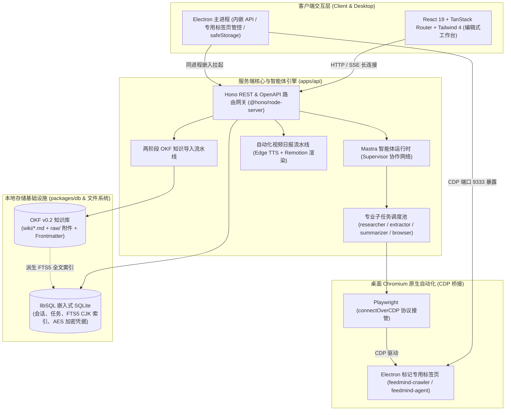

<div align="center">
  
  <h1>FeedMind</h1>
  <p><b>本地优先（Local-First）的个人研究智能体与 OKF 知识工作台</b></p>
  <p>打通「多源情报采集 → 智能体深度研读 → OKF 知识图谱沉淀 → 自动化视频日报」的生产级全流程闭环。</p>

  <p>
    <a href="https://github.com/flyemFSB/FeedMind/releases"></a>
    
    
    
    
    
  </p>
</div>

---

> [!IMPORTANT]
>
> ### 真正的本地优先（Local-First）与数据自主权
>
> 区别于依赖远端黑盒存储的常见 AI 工具，FeedMind 从第一性原理出发构建本地自主的数据与计算底座：
>
> 1. **纯文本知识资产**：知识库严格遵循 **Google OKF（Open Knowledge Format）v0.2** 规范，每个概念均为包含 YAML Frontmatter 的标准 Markdown 文件，天然适配 Git 版本控制与 Obsidian、VS Code 等第三方编辑器。
> 2. **派生数据解耦**：SQLite FTS5 全文索引（CJK 双字符分词）与关系图谱拓扑纯属派生缓存，随时可从纯文本概念文件毫秒级幂等重建，**彻底摆脱私有数据库绑定**。
> 3. **零云端凭据外泄**：基于本地 libSQL 嵌入式 SQLite 运行，API Key 等敏感凭证在入库前均经过 **AES 加密**，桌面端无缝接入操作系统级密钥保管库（Electron `safeStorage`），日志全局自动脱敏。

---

## 系统核心架构

FeedMind 采用强类型全栈 Monorepo 架构，将桌面壳、API 服务、智能体协作网络、浏览器自动化与现代化前端紧密集成：



---

## 核心设计与关键工程实践

### 1. OKF v0.2 标准文件型知识引擎与两阶段提炼流水线

- **两阶段大模型提炼（`ingest-pipeline.ts`）**：
  - **阶段一（结构化解构）**：针对多格式输入（PDF、文档、网页与图片，支持 PaddleOCR 视觉提取与本地降级），抽取核心实体、关系脉络、摘要与证据链。
  - **阶段二（OKF 概念生成）**：结合全局上下文，输出符合 OKF 规范的概念定义，包含前置依赖、双向链接（`[[Concept]]`）、引用来源（`sources`）与校验状态（`verified`），规范化持久化至文件系统。
- **派生全文索引与图谱分析**：采用 CJK bigram 双字符切分算法维护 SQLite FTS5 全文虚表；利用 Graphology 与 Louvain 社区聚类算法，对双向链接网络进行交互式拓扑呈现与聚类洞察。

### 2. Electron 内嵌 API 与 Chromium CDP 原生沙箱隔离

- **单进程内嵌与资源复用**：Electron 主进程直接托管 API 服务并在生产环境同源提供 Web 静态资源；开启专属 CDP 端口（默认 9333），调度带有特定标记的专属自动化窗口（`feedmind-crawler` 与 `feedmind-agent`）。
- **零外部浏览器进程弹出**：基于 Playwright 的 `connectOverCDP` 直连内置 Chromium，内存消耗远低于重复拉起独立浏览器实例的方案；空闲标签页超时自动回收。
- **安全防线断言**：建立 CDP 自动化连接前强制断言客户端 User-Agent 必须包含 `Electron`，物理杜绝接管或干扰用户操作系统的个人浏览器。

### 3. Mastra 智能体协作运行时（Supervisor 架构）

- **多子智能体协作网络**：主智能体 `feedmind-agent` 动态协调 `researcher`（深度研究）、`extractor`（网页提炼）、`summarizer`（结构化总结）与 `browser`（网页交互）完成复合任务。
- **动态模型热解析**：通过请求头 `x-feedmind-model-id` 实现会话级模型无缝切换；运行时自动识别思考模型并过滤不支持的 `temperature` 与 `topP` 参数；静态提示词分段置顶以命中 API 提供商的 Prompt 缓存断点。
- **统一长短期记忆系统**：结合 Mastra `Memory` 与 `LibSQLVector` 提供向量语义检索与会话上下文管理。

### 4. 基于 Remotion 的代码化自动化视频日报流水线

- **端到端全自动闭环**：RSS / 资讯聚类筛选 → 网页深度抓取与正文提炼 → LLM 生成分镜脚本 → 自动化多轮审稿把关 → Edge TTS 语音合成并对齐时间轴 → Remotion 代码化渲染 1080P 视频。
- **确定性声明式渲染**：分镜与字幕完全基于 React 组件渲染，具备像素级还原与稳定的离线导出能力。

### 5. 零信任输入校验与安全防御规范

- **全量输入严格校验**：所有网络输入、模型输出与外部采集结果，必须通过强类型 Zod Schema 过滤和解析。
- **全链路 SSRF 深度防御（`checkSSRF`）**：爬虫工具与外部抓取在发起网络请求前，强制执行 DNS 解析与 IP 白名单拦截，坚决阻断对私有局域网（RFC 1918）、环回地址与云元数据地址（`169.254.169.254`）的非法访问。
- **敏感凭据加密与日志脱敏**：API Key 等凭据入库前使用 AES 加密；系统统一使用 Pino 记录结构化日志，自动脱敏敏感字段。

---

## 核心功能特性矩阵

| 特性模块               | 核心能力                                                                 | 技术支撑                                    |
| :--------------------- | :----------------------------------------------------------------------- | :------------------------------------------ |
| **AI 对话与深度研究**  | 流式会话、工具调用追踪、子智能体协作、模型即时热切换                     | Mastra AI, Vercel AI SDK, AnySearch         |
| **OKF 知识库**         | Markdown 概念阅读与编辑、双向链接网络、Sigma.js 图谱可视化、CJK 全文检索 | OKF v0.2, Milkdown, SQLite FTS5, Graphology |
| **情报采集与订阅**     | 小红书/微信读书会话保活与自适应抓取、CookieCloud 同步、RSS 2.0 聚合      | CDP 协议, Playwright, CookieCloud           |
| **自动化多模态日报**   | 热点聚合、AI 分镜与自动审稿、Edge TTS 语音合成、代码化视频渲染           | Remotion, React 19, msedge-tts              |
| **本地优先与安全底座** | 本地嵌入式 SQLite、系统安全凭据保险箱、全链路 SSRF 防御、操作审计日志    | libSQL, Electron safeStorage, AES, Pino     |

---

## 快速上手

### 方式 1：下载桌面端安装包（推荐日常使用）

前往 [GitHub Releases](https://github.com/flyemFSB/FeedMind/releases) 下载最新 Windows 安装程序（`FeedMind-Setup-*.exe`），运行安装即可使用，内置 API 服务与自动化环境即开即用。

### 方式 2：源码本地开发

#### 前置要求

- **Node.js**：`>= 24.0.0`
- **pnpm**：`12.0.0`

#### 安装与启动

```bash
# 1. 克隆代码仓库
git clone https://github.com/flyemFSB/FeedMind.git
cd FeedMind

# 2. 配置环境变量
cp .env.example .env
# 可编辑 .env 配置自定义 ENCRYPTION_KEY（如 openssl rand -hex 32）

# 3. 安装依赖
pnpm install

# 4. 构建共享包（首次启动必须）
pnpm run build:packages

# 5. 初始化本地数据库（写入初始种子数据）
pnpm run db:init

# 6. 启动全栈开发服务（API + Web 并行热重载）
pnpm run dev
```

#### 本地服务访问入口

| 服务                | 地址                                  | 说明                          |
| :------------------ | :------------------------------------ | :---------------------------- |
| **Web 前端界面**    | http://localhost:13790                | React 19 单页工作台           |
| **REST API 服务**   | http://localhost:18790                | Hono 后端与 Mastra 智能体服务 |
| **交互式 API 文档** | http://localhost:18790/api/v1/docs    | Scalar UI 交互式接口文档      |
| **OpenAPI 规范**    | http://localhost:18790/api/v1/openapi | OpenAPI 3.1 机器可读描述      |

#### 桌面端开发与构建（Electron）

```bash
# 启动桌面开发环境（Vite 前端热重载 + Electron 窗口 + CDP 调试）
pnpm run desktop:dev

# 生产模式构建并直接启动桌面应用
pnpm run desktop

# 打包生成 Windows 生产安装程序（NSIS 安装包）
pnpm run desktop:dist
```

---

## 常用开发命令

```bash
# 运行与调试
pnpm run dev             # 并行启动 API 和 Web 开发服务
pnpm run web:dev         # 仅启动前端服务
pnpm run api:dev         # 仅启动 API 服务
pnpm run desktop:dev     # 启动桌面端完整开发环境

# 构建与打包
pnpm run build           # 全仓库全量构建
pnpm run build:packages  # 仅构建 packages/ 下共享包
pnpm run desktop:dist    # 打包 Windows 安装包

# 代码质量门禁（提交前必须全部通过）
pnpm run fmt:check       # oxfmt 代码格式校验
pnpm run fmt             # oxfmt 自动格式化写入
pnpm run typecheck       # TypeScript 严格类型检查（0 错误）
pnpm run lint            # oxlint 代码规范检查（0 error 0 warning）
pnpm run test            # Vitest 全仓库单元与集成测试（100% PASS）
pnpm run test:coverage   # 输出测试覆盖率报告

# 数据库管理
pnpm run db:init         # 写入默认模型、工具配置等初始种子数据
pnpm run db:push         # 通过 drizzle-kit 同步 schema 修改
pnpm run db:reset        # 清空并重置本地 SQLite 数据库
```

---

## 项目全景目录结构

```
feedmind/
├── apps/                          # 应用程序
│   ├── api/                       # 服务端核心与 Mastra 智能体运行时
│   │   ├── remotion/              # Remotion 视频组件与分镜渲染
│   │   └── src/
│   │       ├── lib/               # 工具集（日志、HTTP 助手、SSRF 防御、加密等）
│   │       ├── mastra/            # 智能体网络（主 Agent、子 Agent、工具链、工作流）
│   │       ├── modules/           # 业务领域模块（wiki、models、daily-report 等）
│   │       ├── routes/v1/         # OpenAPI v1 路由树
│   │       ├── app.ts             # Hono 应用实例与中间件装配
│   │       ├── server.ts          # API 服务启动入口
│   │       └── server-core.ts     # 核心启动编排（支持桌面端同源内嵌）
│   ├── desktop/                   # Electron 桌面端外壳
│   │   └── src/
│   │       ├── main.ts            # 主进程生命周期、CDP 端口与标记窗口管控
│   │       ├── safe-storage.ts    # 系统级凭据安全加解密
│   │       └── env-bootstrap.ts   # 桌面环境变量加载
│   └── web/                       # React 19 现代化前端工作台
│       └── src/
│           ├── app/               # 顶层布局 Shell 与抽屉式 AI 聊天工作区
│           ├── components/        # UI 基础组件（Base UI）与 AI Elements
│           ├── lib/               # 契约客户端、模型换算、hooks、i18n 国际化
│           ├── pages/             # 核心业务页面（wiki、daily-report、feeds、settings）
│           └── routes/            # TanStack Router 文件系统路由
├── packages/                      # 领域共享包
│   ├── contracts/                 # 跨端强类型契约与 Zod 校验 Schema
│   ├── crawler-core/              # 基于 CDP 与 Playwright 的自动化抓取引擎
│   ├── db/                        # 本地 libSQL SQLite 基础设施与预编译 DDL
│   ├── env/                       # 基于 @t3-oss/env-core 的强类型环境变量解析
│   └── wiki-core/                 # OKF 规范 Bundle 解析、文档提取与图算法引擎
├── data/                          # 本地数据资产（默认在 .gitignore 中忽略）
│   ├── feedmind.db                # 本地 SQLite 数据库
│   └── wiki/                      # OKF 知识库 Bundle 根目录
├── AGENTS.md                      # 项目第一性原理与架构开发规范
├── DESIGN.md                      # 视觉设计系统与主题设计规范
├── package.json                   # 根工作区配置与开发脚本
└── pnpm-workspace.yaml            # pnpm Monorepo 依赖拓扑定义
```

---

## 全栈技术选型

| 维度           | 关键技术                                | 选型用途                                               |
| :------------- | :-------------------------------------- | :----------------------------------------------------- |
| **前端交互**   | React 19 + TanStack Router              | 现代化单页架构、深层类型安全文件路由与自动代码分割     |
| **样式与动效** | Tailwind CSS 4 + Base UI + Motion       | 高质感编辑式视觉、无障碍原子组件体系与平滑微动效       |
| **富文本编辑** | Milkdown Crepe                          | 所见即所得 Markdown 编辑器，深度融合 OKF 双向链接      |
| **知识图谱**   | Sigma.js + Graphology                   | 基于 WebGL 的高性能知识拓扑渲染与 Louvain 社区聚类     |
| **服务端网关** | Hono + `@hono/zod-openapi`              | 轻量高效 Web 网关、严格契约校验与 Scalar 交互式文档    |
| **AI 智能体**  | Mastra AI + Vercel AI SDK               | 智能体协作运行时、流式多轮对话与向量长期记忆           |
| **本地数据库** | libSQL (`@libsql/client`) + Drizzle ORM | 嵌入式 SQLite 引擎、WAL 并发模式与预编译静态 DDL       |
| **桌面运行时** | Electron 44 + safeStorage               | 单体桌面交付、内置 Chromium CDP 调度与系统级密钥保险箱 |
| **媒体合成**   | Remotion + msedge-tts                   | 代码驱动 1080P 视频逐帧渲染与多模态语音合成            |
| **工程工具链** | pnpm 12 + oxlint + oxfmt + Vitest       | 极速依赖拓扑、Rust 级静态分析、全仓库统一格式化与测试  |

---

## 核心 API 路由概览

所有业务接口均挂载于 `/api/v1` 前缀下：

| 模块               | 方法与路由                                                                                                | 功能说明                                             |
| :----------------- | :-------------------------------------------------------------------------------------------------------- | :--------------------------------------------------- |
| **模型管理**       | `GET /api/v1/models`<br>`POST /api/v1/models`<br>`GET /api/v1/models/catalog`                             | 管理模型配置、API 密钥与拉取 models.dev 在线目录     |
| **会话研究**       | `GET /api/v1/chats`<br>`POST /api/v1/chats`<br>`POST /api/v1/chats/:id/messages`                          | 管理研究会话、上下文追踪与流式对话交互               |
| **OKF 知识库**     | `GET /api/v1/wiki/spaces`<br>`GET /api/v1/wiki/spaces/:id/pages`<br>`POST /api/v1/wiki/spaces/:id/ingest` | 知识空间管理、OKF 概念读取与两阶段提炼导入           |
| **知识图谱与检索** | `GET /api/v1/wiki/spaces/:id/graph`<br>`POST /api/v1/wiki/spaces/:id/search`                              | 获取关系图谱拓扑、社区洞察与 CJK FTS5 混合检索       |
| **资讯与采集**     | `GET /api/v1/feeds`<br>`GET /api/v1/rss-sources`<br>`POST /api/v1/crawler/tasks`                          | 阅读聚合资讯流、管理 RSS 订阅源与触发自动化抓取      |
| **视频日报**       | `GET /api/v1/daily-reports`<br>`POST /api/v1/daily-reports/generate`                                      | 查看日报列表、触发选题提取与 Remotion 视频渲染       |
| **系统与安全**     | `GET /api/v1/ops-log`<br>`GET /api/v1/health`<br>`GET /api/v1/docs`                                       | 查看系统操作审计日志、服务健康检查与 Scalar API 文档 |

---

## 环境变量说明

FeedMind 通过 `@feedmind/env` 对环境变量进行严格的类型断言与默认值装配：

| 环境变量                | 是否必需         | 默认值                        | 详细说明                                                        |
| :---------------------- | :--------------- | :---------------------------- | :-------------------------------------------------------------- |
| `ENCRYPTION_KEY`        | 否（有安全降级） | `feedmind`                    | 用于加密落库敏感凭证的 AES 密钥（生产环境建议设为 64 字符 Hex） |
| `DATABASE_PATH`         | 否               | `./data/feedmind.db`          | 本地 SQLite 数据库文件落盘路径                                  |
| `WIKI_DIR`              | 否               | `data/wiki`                   | OKF 知识库 Bundle 本地存储目录                                  |
| `API_HOST`              | 否               | `127.0.0.1`                   | API 服务监听地址（容器化部署时可配置为 `0.0.0.0`）              |
| `API_PORT`              | 否               | `18790`                       | API 服务监听端口                                                |
| `CDP_PORT`              | 否               | `9333`                        | 桌面端 Chromium CDP 远程调试端口                                |
| `LOG_LEVEL`             | 否               | `debug` (dev) / `info` (prod) | Pino 结构化日志最低输出等级                                     |
| `DISABLE_INGEST_WORKER` | 否               | —                             | 设为 `1` 时禁用后台 Wiki 异步导入处理 Worker                    |

---

## 开源许可证

本项目采用 [MIT License](./LICENSE) 开源协议。

<div align="center">

**Built with ❤️ using React 19, Hono, Mastra & TanStack Router**

本地优先 · 数据自主 · 你的智能知识引擎

</div>
