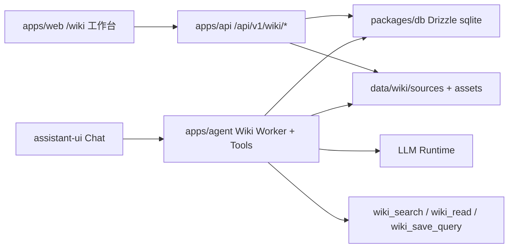
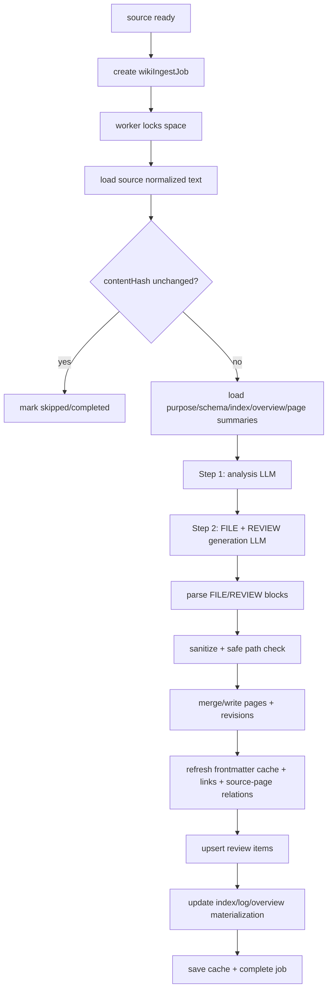

# FeedMind 复刻 llm_wiki Wiki 功能完整方案

> 调研基准：`nashsu/llm_wiki` commit `0e292ee0902a822bbcda626d7a08e332c608e970`，提交时间 `2026-06-03 15:36:18 +0800`，远端仓库：[https://github.com/nashsu/llm_wiki](https://github.com/nashsu/llm_wiki)。

## 0. 结论

FeedMind 不应逐字复制 `llm_wiki` 的 Tauri + 文件 vault 实现。当前 FeedMind 已经是 `pnpm` monorepo，包含 `apps/web`、`apps/api`、`apps/agent`、`packages/contracts`、`packages/db` 和 `packages/shared`；`apps/web/app/wiki/page.tsx` 目前只是占位页，README 也明确写了 “Wiki 业务 API 本阶段不迁移”。因此推荐方案是：

- 保留 `llm_wiki` 的核心语义：`Raw Sources -> Wiki Pages -> Schema/Purpose`，以及 Ingest、Query、Lint 三类操作。
- 改成 FeedMind 的数据库/API/Agent 架构：API 管状态和文件/来源生命周期，Agent 管 LLM 分析与生成，Web 管编辑、图谱、Review、Lint 和来源管理。
- 不引入向量检索：不做 embedding 配置、LanceDB/pgvector、vector score、RRF 的 vector 合并，也不为页面生成 embedding。
- 仍保留 `[[wikilink]]`、frontmatter、source traceability、index/log/overview、Review/Lint、关键词检索、图谱扩展、多格式导入、网页剪藏等 Wiki 能力。

一句话：在 FeedMind 中复刻的是 `llm_wiki` 的“知识库工作流和文档语义”，不是它的桌面文件系统技术栈。

## 1. 明确假设与非目标

### 假设

- FeedMind 继续以本地优先为主，不先引入多用户权限系统。
- 当前代码现状以 `@libsql/client` + Drizzle `sqliteTable` 为准；README 中的 PostgreSQL + pgvector 表述不作为本方案依赖。
- Wiki 初期可以只有一个默认空间，但数据模型应支持多个 `wiki_space`，避免后续返工。
- Wiki 生成仍由 LLM 完成，但 LLM 调用应放在 `apps/agent` 或复用 Agent 的模型运行时，不把重型 LLM 依赖塞进 `apps/api`。
- 原始来源文件可以存储在 `data/wiki/sources/<sourceId>/`，数据库保存元数据、规范化文本、hash、状态和关联关系。

### 非目标

- 不实现向量检索、embedding 生成、pgvector、LanceDB、语义 ANN 搜索。
- 不复刻 Tauri 桌面能力本身，例如系统托盘、原生文件 watcher、Tauri store、Rust 本地端口。
- 不把 Wiki 设计成必须兼容 Obsidian 的真实文件 vault；但保留 Markdown 语义，并提供后续导出为 vault 的能力。
- 不在第一阶段做 OCR、音视频转写和图片视觉 caption。可以保留扩展点。

## 2. llm_wiki 的 Wiki 实现拆解

### 2.1 三层结构

`llm-wiki.md` 和 README 描述的核心结构是：

| 层 | llm_wiki 实现 | 作用 |
|---|---|---|
| Raw Sources | `raw/sources/` | 用户导入的原始资料，LLM 读取但不直接修改。 |
| Wiki | `wiki/index.md`、`wiki/log.md`、`wiki/overview.md`、`wiki/entities/*`、`wiki/concepts/*`、`wiki/sources/*` 等 | LLM 生成和维护的结构化 Markdown 页面。 |
| Schema/Purpose | `schema.md`、`purpose.md` | 约束页面类型、命名、frontmatter、交叉引用和项目目标。 |

工程实现中，项目根目录还包含：

- `.llm-wiki/ingest-queue.json`：持久化 ingest 队列。
- `.llm-wiki/ingest-cache.json`：来源 hash 到已写页面的缓存。
- `.llm-wiki/review.json`、`.llm-wiki/lint.json`：Review/Lint UI 状态。
- `.llm-wiki/chats/*.json`：会话持久化。
- `.obsidian/`：Obsidian 兼容配置。

### 2.2 项目初始化与模板

相关文件：

- `src-tauri/src/commands/project.rs`
- `src/lib/templates.ts`
- `src/lib/project-identity.ts`
- `src/lib/project-store.ts`

`llm_wiki` 创建项目时会生成：

- `purpose.md`
- `schema.md`
- `wiki/index.md`
- `wiki/log.md`
- `wiki/overview.md`
- 基础目录：`wiki/entities`、`wiki/concepts`、`wiki/sources`、`wiki/queries`、`wiki/comparisons`、`wiki/synthesis`
- `.obsidian` 配置

`templates.ts` 又提供 Research、Reading、Personal Growth、Business、General 五类模板，每类模板会扩展 page types、extra dirs、purpose 内容和 schema 规则。

FeedMind 应复刻模板语义，但不需要生成真实目录；应转换为 `wiki_spaces` 的配置、默认页面和 page type 注册表。

### 2.3 来源生命周期

相关文件：

- `src/components/sources/sources-view.tsx`
- `src/lib/source-lifecycle.ts`
- `src/lib/source-identity.ts`
- `src/lib/source-delete-decision.ts`
- `src/lib/wiki-page-delete.ts`
- `src/lib/wiki-cleanup.ts`

关键实现：

- 支持导入文件和导入文件夹。
- 文件复制到 `raw/sources/`，二进制/Office/PDF 先做文本预处理缓存。
- 支持的来源扩展包括 `md/mdx/txt/pdf/doc/docx/pptx/xlsx/odt/odp/ods/xls/csv/json/html/xml/yaml` 等。
- source identity 不是单纯 basename，而是尽量保留 `raw/sources/` 下的相对路径；有子目录时 source summary slug 会带稳定 hash，避免同名文件冲突。
- 删除 source 时：
  - 删除原始文件和 `.cache/<filename>.txt`。
  - 移除 ingest cache。
  - 扫描 Wiki 页面 frontmatter 的 `sources`。
  - 若页面只来自被删除 source，则级联删除页面。
  - 若页面还来自其他 source，则只重写 `sources` 数组。
  - 清理 `index.md`、正文 `[[wikilink]]` 和 frontmatter `related` 中的死引用。

FeedMind 应把这套生命周期变成数据库事务和后台任务，而不是前端状态里的文件扫描。

### 2.4 Ingest 流水线

核心文件：

- `src/lib/ingest.ts`
- `src/lib/ingest-queue.ts`
- `src/lib/ingest-cache.ts`
- `src/lib/ingest-sanitize.ts`
- `src/lib/page-merge.ts`
- `src/lib/sources-merge.ts`
- `src/lib/project-mutex.ts`

关键实现点：

1. 串行队列：同一项目一次只处理一个 ingest，队列持久化到 `.llm-wiki/ingest-queue.json`，支持恢复、取消、重试，失败最多重试 3 次。
2. 缓存：对来源内容做 SHA256，未变化且已写页面仍存在时跳过完整 LLM ingest。
3. 两阶段 LLM：
   - Step 1 Analysis：读取 source、schema、purpose、index、overview，生成结构化分析。
   - Step 2 Generation：基于分析输出 `---FILE: wiki/path.md--- ... ---END FILE---` 和可选 `---REVIEW---` blocks。
4. 安全解析：
   - `parseFileBlocks()` 识别 FILE block。
   - `isSafeIngestPath()` 限制只能写入 `wiki/`，拒绝绝对路径、`..`、Windows 非法文件名和控制字符。
   - `sanitizeIngestedFileContent()` 修复 LLM 常见错误，例如整页被代码块包住、缺少 opening frontmatter fence、无效 wikilink list。
5. 页面写入：
   - `wiki/log.md` 追加。
   - `wiki/index.md`、`wiki/overview.md` 等 listing 页面覆盖。
   - 普通页面如果已存在，用 `mergePageContent()` 合并。
6. 页面合并：
   - `sources/tags/related` 数组做确定性 union。
   - `type/title/created` 保留旧值。
   - body 差异交给 LLM 合并。
   - 若 LLM 合并输出无 frontmatter 或明显缩短，则回退到数组合并 + 新 body，并保留备份。
7. Review：解析 ingest 输出的 REVIEW block，写入 review store。
8. 长文档：根据 context budget 对长文档做语义分块、局部分析、全局 digest 和 checkpoint。

排除项：`ingest.ts` 后续的 `embedPage()` 和 caption 后 re-embed 都不纳入 FeedMind 复刻。

### 2.5 Wiki 页面读取、编辑和渲染

相关文件：

- `src/components/editor/wiki-editor.tsx`
- `src/components/editor/wiki-reader.tsx`
- `src/components/editor/frontmatter-panel.tsx`
- `src/lib/frontmatter.ts`
- `src/lib/wikilink-transform.ts`
- `src/lib/wiki-page-resolver.ts`
- `src/lib/markdown-image-resolver.ts`

关键实现：

- 默认读模式，编辑模式需要用户主动切换。
- 读模式会把 `[[target]]` 和 `[[target|alias]]` 转成 markdown fragment link，再拦截点击，解析到实际 wiki 页面。
- 编辑模式不能持久化转换后的普通 Markdown 链接，否则会破坏 Obsidian 风格 wikilink。
- frontmatter 解析有容错逻辑，可从 LLM 生成的轻微坏格式中恢复。
- 支持 GFM、KaTeX、Mermaid、表格、图片路径解析。

FeedMind 应保持“展示层可转换，存储层保留原始 wikilink”的边界。

### 2.6 Review 与 Lint

相关文件：

- `src/stores/review-store.ts`
- `src/components/review/review-view.tsx`
- `src/lib/review-utils.ts`
- `src/lib/sweep-reviews.ts`
- `src/lib/lint.ts`
- `src/stores/lint-store.ts`
- `src/components/lint/lint-view.tsx`

Review 来源：

- ingest 生成的 REVIEW blocks。
- graph insights 触发的研究建议。
- chat 中 “Save to Wiki” 或 review action 生成的页面。

Review 类型：

- `contradiction`
- `duplicate`
- `missing-page`
- `confirm`
- `suggestion`

Review action：

- 创建页面。
- 打开/查看页面。
- 删除文件。
- Deep Research。
- skip/dismiss。

Lint 分两类：

- Structural lint：orphan、broken-link、no-outlinks。
- Semantic lint：LLM 检查 contradiction、stale、missing-page、suggestion，并输出 `---LINT---` blocks。

FeedMind 应将 Review/Lint 从 Zustand + JSON 文件改成持久化表，并通过 API 操作。

### 2.7 搜索与 Query，不含向量

相关文件：

- `src/lib/search.ts`
- `src-tauri/src/commands/search.rs`
- `src/lib/graph-relevance.ts`
- `src/components/chat/chat-panel.tsx`
- `src/lib/context-budget.ts`

`llm_wiki` 的 Query 流程：

1. 问候类输入短路，不跑检索。
2. 读取 `wiki/index.md` 和 `purpose.md`。
3. 关键词搜索：
   - 中英文 tokenization。
   - CJK bigram + 单字补充。
   - title、filename、phrase、content token 分别打分。
   - 生成 snippet 和 titleMatch。
4. 图谱扩展：
   - top search results 作为 seed。
   - 使用 direct link、source overlap、Adamic-Adar common neighbor、type affinity 计算相关度。
   - 扩展每个 seed 的 top 相关页面。
5. context budget：
   - 5% index。
   - 50% retrieved pages。
   - 15% response reserve。
   - 每页有截断上限。
6. system prompt 包含 purpose、裁剪后的 index、page list、编号页面和引用规则。
7. 模型回答后通过隐藏注释记录引用页，UI 展示 cited references。
8. 用户可以把有价值的回答保存为 `wiki/queries/*.md`，再进入 ingest，提取实体和概念。

FeedMind 应复刻关键词检索、图谱扩展、context budget 和 cited references；排除 embedding 查询、vectorHits、vectorScore 和 RRF vector 合并。

### 2.8 知识图谱

相关文件：

- `src/lib/wiki-graph.ts`
- `src/lib/graph-relevance.ts`
- `src/lib/graph-insights.ts`
- `src/lib/graph-filters.ts`
- `src/components/graph/graph-view.tsx`

核心功能：

- 扫描所有 wiki Markdown，提取 title、type、path、wikilinks。
- 排除 `query` 节点，因为 query 是中间产物，实体/概念页面才是知识结构。
- 去重无向边。
- 用 4 信号相关度给边加权：
  - direct link：3.0
  - source overlap：4.0
  - common neighbor / Adamic-Adar：1.5
  - type affinity：1.0
- 使用 Louvain 做 community detection，并计算 cohesion。
- 图谱 UI 支持 type/community 色彩模式、搜索、过滤、隐藏节点、hover 高亮、insights。
- Insights 包括 surprising connections、isolated pages、sparse communities、bridge nodes。

FeedMind 可将图谱构建放在 API 层，前端用 sigma.js + graphology 展示；或先用简化列表/表格验证图谱数据，再上可视化。

### 2.9 多格式导入与网页剪藏

相关文件：

- `src-tauri/src/commands/fs.rs`
- `src/lib/source-lifecycle.ts`
- `extension/popup.js`
- `src-tauri/src/clip_server.rs`
- `src/lib/clip-watcher.ts`

llm_wiki 做法：

- PDF、Office、表格等预处理成 Markdown/text，并缓存到 source 同目录的 `.cache/<file>.txt`。
- PDF 使用 PDFium 相关抽取。
- DOCX、PPTX、XLSX/ODS 等由 Rust 库和 ZIP/XML/calamine 处理。
- Chrome extension 用 Readability.js + Turndown.js 把网页正文转 Markdown，POST 到本地 clip server，再写入 `raw/sources/*.md` 并由前端轮询入队。

FeedMind 当前是 Web + Hono，不是 Tauri，所以：

- 文件导入应通过 Web 上传到 Hono API。
- 文件夹导入可以先支持浏览器 `webkitdirectory` 或压缩包上传；真正的本地目录 watch 需要服务端配置 watch path。
- 网页剪藏可以复用“浏览器扩展 -> Hono API”的形态，不需要独立 Rust 端口。

## 3. FeedMind 当前状态对照

| 维度 | 当前 FeedMind | 对复刻 Wiki 的影响 |
|---|---|---|
| 前端 | `apps/web`，Next.js 16 + React 19 + assistant-ui + shadcn | `/wiki` 已存在但为占位页；需要补 Wiki 工作台。 |
| API | `apps/api`，Hono REST API，统一 `ApiEnvelope` | Wiki CRUD、source、job、review、lint 应走 `/api/v1/wiki/*`。 |
| Agent | `apps/agent`，LangChain.js + LangGraph JS Server | LLM ingest、semantic lint、query context 注入适合放这里。 |
| DB | `packages/db`，Drizzle + libsql/sqlite | 先按 sqlite schema 建模，避免 pgvector。 |
| Contracts | `packages/contracts`，zod 类型 | 新增 `contracts/src/wiki` 作为前后端单一契约。 |
| 当前 Wiki | `apps/web/app/wiki/page.tsx` 占位，不请求后端 | 可以安全从零设计，不需要兼容旧 Wiki API。 |
| 旧文档 | Git HEAD 中有旧 `docs/wiki-operations-implementation-plan.md`，工作区已删除 | 旧计划偏迁移前 FastAPI/PostgreSQL；本方案只吸收“来源/任务/Review”思路。 |

## 4. 方案选择

### 方案 A：文件 vault 精确复刻

实现方式：FeedMind 在 `data/wiki/<space>/` 下生成真实 `purpose.md`、`schema.md`、`wiki/*`、`raw/sources/*`，API 只是文件系统封装。

优点：

- 最接近 llm_wiki。
- Markdown 文件天然可被 Obsidian/Git 使用。
- 实现 `index.md`、`log.md`、wikilink 语义直接。

缺点：

- 与 FeedMind 当前数据库/API 架构不一致。
- Web 应用不能直接操作任意本地文件，最终仍要通过 API。
- 并发、事务、任务恢复、Review 状态、页面关系查询会变复杂。

### 方案 B：数据库优先，保留 Markdown 语义

实现方式：数据库保存 space/source/page/link/job/review/lint，页面 content 仍是 Markdown，path 仍使用 `wiki/concepts/foo.md` 这样的逻辑路径。

优点：

- 符合 FeedMind 现有 `apps/api + packages/db + contracts` 架构。
- 任务状态、页面关系、source traceability、Review/Lint 更容易持久化和查询。
- 后续可以导出 Obsidian vault，而不是让 vault 成为运行时依赖。
- 更容易把 Wiki 接入现有 Agent 和 assistant-ui。

缺点：

- 与 llm_wiki 的真实文件夹体验不完全一致。
- 需要额外实现导出/导入，才能获得 Obsidian 兼容。

### 推荐

选择方案 B。理由是 FeedMind 当前已经明确把 Wiki 业务延后，现有业务已经按数据库/API/共享契约组织。复刻应尊重现有系统边界，而不是把 Tauri 文件 vault 强行塞回 Web monorepo。

## 5. 目标架构



模块边界：

- `packages/contracts/src/wiki`：zod schema 和 TS 类型。
- `packages/db/src/schema/wiki.ts`：Wiki 表。
- `apps/api/src/modules/wiki/*`：CRUD、source lifecycle、job orchestration、search、graph、lint result persistence。
- `apps/api/src/routes/v1/wiki.ts`：HTTP route。
- `apps/agent/src/wiki/*`：LLM ingest worker、prompt、FILE/REVIEW parser、semantic lint、wiki tools。
- `apps/web/components/wiki/*`：Wiki 工作台 UI。

## 6. 数据模型

字段命名遵循现有 Drizzle 风格：TS camelCase，数据库 snake_case。数组/对象在 sqlite 中用 `text` JSON 存储，进入 contracts 时解析为结构化类型。

### 6.1 wikiSpaces

保存一个 Wiki 项目的全局配置。

| 字段 | 说明 |
|---|---|
| `id` | UUID |
| `name` | 空间名 |
| `template` | `research`、`reading`、`personal`、`business`、`general` |
| `purpose` | `purpose.md` 等价内容 |
| `schema` | `schema.md` 等价内容 |
| `settings` | JSON，输出语言、启用 page types 等 |
| `createdAt` / `updatedAt` | 时间戳 |

初期可以自动创建一个默认 space：`My Wiki`。

### 6.2 wikiPages

保存 Markdown 页面。

| 字段 | 说明 |
|---|---|
| `id` | UUID |
| `spaceId` | 所属空间 |
| `path` | 逻辑路径，如 `wiki/concepts/chain-of-thought.md` |
| `slug` | 文件名去 `.md`，用于 wikilink 解析 |
| `type` | `entity`、`concept`、`source`、`query`、`comparison`、`synthesis`、`overview` 等 |
| `title` | frontmatter title |
| `content` | 完整 Markdown，包括 frontmatter |
| `frontmatter` | JSON 缓存，便于查询 |
| `sources` | JSON 数组缓存 |
| `tags` | JSON 数组缓存 |
| `related` | JSON 数组缓存 |
| `createdAt` / `updatedAt` | 时间戳 |

索引：

- `(space_id, path)` unique
- `(space_id, slug)`
- `(space_id, type)`
- `(space_id, updated_at)`

说明：`slug` 不强制 unique，重复 slug 由 lint 报告；解析 wikilink 时优先 exact path，其次唯一 slug，否则返回冲突。

### 6.3 wikiPageRevisions

保存页面改写历史，替代 llm_wiki 的 `.llm-wiki/page-history`。

| 字段 | 说明 |
|---|---|
| `id` | UUID |
| `pageId` | 页面 |
| `jobId` | 来源 job，可为空 |
| `beforeContent` | 改写前 |
| `afterContent` | 改写后 |
| `reason` | `ingest`、`merge`、`manual_edit`、`lint_apply` |
| `createdAt` | 时间戳 |

### 6.4 wikiSources

保存原始来源。

| 字段 | 说明 |
|---|---|
| `id` | UUID |
| `spaceId` | 所属空间 |
| `identity` | llm_wiki 的 source identity，如 `papers/wei-2022.pdf` |
| `title` | 显示标题 |
| `kind` | `file`、`text`、`url`、`clip`、`generated` |
| `originalName` | 原始文件名 |
| `originalUri` | URL 或导入来源 |
| `storagePath` | `data/wiki/sources/<id>/original` |
| `normalizedText` | 规范化文本/Markdown；大文件可改为 `normalizedPath` |
| `contentHash` | SHA256 |
| `mimeType` | MIME |
| `sizeBytes` | 大小 |
| `status` | `new`、`queued`、`ingesting`、`ready`、`failed`、`deleted` |
| `metadata` | JSON，如页数、sheet 名、导入器版本 |
| `createdAt` / `updatedAt` | 时间戳 |

索引：

- `(space_id, identity)` unique
- `(space_id, content_hash)`
- `(space_id, status)`

### 6.5 wikiSourcePages

保存 source 与 page 的追溯关系。

| 字段 | 说明 |
|---|---|
| `sourceId` | 来源 |
| `pageId` | 页面 |
| `jobId` | 写入页面的 job |
| `relation` | `created`、`updated`、`cited`、`removed` |
| `createdAt` | 时间戳 |

这张表替代只靠 frontmatter `sources` 的脆弱追溯。

### 6.6 wikiLinks

保存 `[[wikilink]]` 解析结果。

| 字段 | 说明 |
|---|---|
| `id` | UUID |
| `spaceId` | 空间 |
| `fromPageId` | 来源页面 |
| `toPageId` | 目标页面，可为空 |
| `rawTarget` | `[[...]]` 中的 target |
| `alias` | alias |
| `status` | `resolved`、`missing`、`ambiguous` |

每次页面写入后刷新该页面 links。Graph 和 broken-link lint 都基于此表。

### 6.7 wikiIngestJobs

持久化队列，替代 `.llm-wiki/ingest-queue.json`。

| 字段 | 说明 |
|---|---|
| `id` | UUID |
| `spaceId` | 空间 |
| `sourceId` | 来源，可为空 |
| `type` | `import`、`ingest`、`reingest`、`lint`、`semantic_lint`、`graph_refresh` |
| `status` | `queued`、`running`、`cancel_requested`、`completed`、`failed`、`canceled` |
| `stage` | `normalizing`、`analyzing`、`generating`、`writing`、`reviewing` |
| `progressCurrent` / `progressTotal` | 进度 |
| `attempt` | 当前尝试次数 |
| `maxAttempts` | 默认 3 |
| `input` | JSON |
| `output` | JSON |
| `error` | 错误信息 |
| `startedAt` / `finishedAt` | 时间戳 |
| `createdAt` / `updatedAt` | 时间戳 |

### 6.8 wikiReviewItems

| 字段 | 说明 |
|---|---|
| `id` | UUID |
| `spaceId` | 空间 |
| `sourceId` / `pageId` / `jobId` | 关联对象 |
| `type` | `contradiction`、`duplicate`、`missing_page`、`confirm`、`suggestion` |
| `severity` | `info`、`warning`、`error` |
| `status` | `open`、`resolved`、`dismissed` |
| `title` | 标题 |
| `description` | 描述 |
| `affectedPages` | JSON 数组 |
| `searchQueries` | JSON 数组 |
| `options` | JSON action 列表 |
| `resolvedAction` | 用户选择 |
| `createdAt` / `resolvedAt` | 时间戳 |

### 6.9 wikiLintRuns / wikiLintItems

`wikiLintRuns` 保存一次 lint 执行，`wikiLintItems` 保存结果。

Lint item 类型：

- `orphan`
- `broken_link`
- `no_outlinks`
- `duplicate_slug`
- `invalid_frontmatter`
- `semantic`

### 6.10 wikiGraphInsightDismissals

保存用户已忽略的 surprising connection / knowledge gap，避免刷新后重复出现。

## 7. API 设计

统一挂载到 `/api/v1/wiki`，返回 FeedMind 现有 `ApiEnvelope<T>`。

### 7.1 Space

| 方法 | 路径 | 说明 |
|---|---|---|
| `GET` | `/wiki/spaces` | 列出空间 |
| `POST` | `/wiki/spaces` | 创建空间，选择模板 |
| `GET` | `/wiki/spaces/:spaceId` | 空间详情 |
| `PATCH` | `/wiki/spaces/:spaceId` | 更新 name/purpose/schema/settings |

### 7.2 Pages

| 方法 | 路径 | 说明 |
|---|---|---|
| `GET` | `/wiki/spaces/:spaceId/pages` | 页面列表，支持 `type`、`q` |
| `POST` | `/wiki/spaces/:spaceId/pages` | 手动创建页面 |
| `GET` | `/wiki/spaces/:spaceId/pages/:pageId` | 页面详情 |
| `PUT` | `/wiki/spaces/:spaceId/pages/:pageId` | 保存 Markdown |
| `DELETE` | `/wiki/spaces/:spaceId/pages/:pageId` | 删除页面并清理 links/index |
| `GET` | `/wiki/spaces/:spaceId/pages/resolve?target=` | 解析 wikilink |
| `GET` | `/wiki/spaces/:spaceId/pages/:pageId/revisions` | 页面历史 |

### 7.3 Sources

| 方法 | 路径 | 说明 |
|---|---|---|
| `GET` | `/wiki/spaces/:spaceId/sources` | 来源列表 |
| `POST` | `/wiki/spaces/:spaceId/sources/text` | 创建纯文本来源 |
| `POST` | `/wiki/spaces/:spaceId/sources/files` | multipart 文件导入 |
| `POST` | `/wiki/spaces/:spaceId/sources/url` | 网页/URL 导入 |
| `GET` | `/wiki/spaces/:spaceId/sources/:sourceId` | 来源详情 |
| `POST` | `/wiki/spaces/:spaceId/sources/:sourceId/ingestions` | 启动 ingest/reingest |
| `DELETE` | `/wiki/spaces/:spaceId/sources/:sourceId?mode=` | 删除来源，`detach` / `delete-orphans` |

### 7.4 Jobs

| 方法 | 路径 | 说明 |
|---|---|---|
| `GET` | `/wiki/spaces/:spaceId/jobs` | 任务列表 |
| `GET` | `/wiki/spaces/:spaceId/jobs/:jobId` | 任务详情 |
| `POST` | `/wiki/spaces/:spaceId/jobs/:jobId/cancel` | 请求取消 |
| `POST` | `/wiki/spaces/:spaceId/jobs/:jobId/retry` | 重试 |

第一阶段可以用轮询，后续再加 SSE。

### 7.5 Search / Graph

| 方法 | 路径 | 说明 |
|---|---|---|
| `POST` | `/wiki/spaces/:spaceId/search` | 关键词搜索，不含 vector |
| `GET` | `/wiki/spaces/:spaceId/graph` | 图谱 nodes/edges/communities |
| `GET` | `/wiki/spaces/:spaceId/graph/insights` | surprising connections / gaps |
| `POST` | `/wiki/spaces/:spaceId/graph/insights/:key/dismiss` | 忽略 insight |

### 7.6 Review / Lint

| 方法 | 路径 | 说明 |
|---|---|---|
| `GET` | `/wiki/spaces/:spaceId/review-items` | Review 列表 |
| `POST` | `/wiki/spaces/:spaceId/review-items/:itemId/resolve` | 执行动作 |
| `POST` | `/wiki/spaces/:spaceId/review-items/:itemId/dismiss` | 忽略 |
| `POST` | `/wiki/spaces/:spaceId/lint-runs` | 启动 lint |
| `GET` | `/wiki/spaces/:spaceId/lint-runs` | lint run 列表 |
| `GET` | `/wiki/spaces/:spaceId/lint-items` | lint item 列表 |

## 8. Agent 与 Job 流水线

### 8.1 职责划分

- API 创建 job、更新状态、读写数据库、处理文件上传。
- Agent worker 领取 `queued` job，执行 LLM 相关步骤。
- Agent 通过 `packages/db` 直接写页面，或调用 API 内部 service。推荐直接用 DB service，避免 worker 反向 HTTP 调 API。

### 8.2 Ingest job 流程



### 8.3 Prompt contract

继续使用 llm_wiki 的 FILE block 约定，因为它非常适合把 LLM 输出转成多页面写入：

```text
---FILE: wiki/concepts/example.md---
---
type: concept
title: Example
sources: ["paper.pdf"]
tags: []
related: []
---

# Example

...
---END FILE---
```

Review block 使用结构化格式：

```text
---REVIEW: missing-page | warning | Title---
Description...
PAGES: wiki/concepts/a.md, wiki/entities/b.md
SEARCH: query one | query two
OPTIONS: Create Page | Skip
---END REVIEW---
```

约束：

- FILE path 必须以 `wiki/` 开头。
- 禁止绝对路径、`..`、控制字符、Windows 非法文件名。
- 所有生成页面必须包含 frontmatter。
- 所有由 source 生成的普通页面必须包含该 source identity。
- `wiki/log.md` 追加，普通页面 merge，`index/overview` 可覆盖或由服务端重建。

### 8.4 页面合并规则

复制 llm_wiki 的三层保护，但改为 DB revision：

1. `sources`、`tags`、`related` 永远确定性 union。
2. `type`、`title`、`created` 不允许被新 ingest 随意覆盖。
3. body 差异交给 LLM merge。
4. merge 输出必须有 frontmatter，且 body 不能明显短于输入，否则回退。
5. 每次改写写入 `wikiPageRevisions`。

### 8.5 长文档

保留 llm_wiki 的分块思想：

- 小于预算：单次 analysis。
- 大于预算：按 Markdown 标题/段落语义分块，带 overlap。
- 每块生成 chunk analysis。
- 汇总成 global digest。
- generation 阶段只看 digest + chunk analyses，不假设原文完整进入上下文。
- checkpoint 存在 `wikiIngestJobs.output.longSourceCheckpoint` 或独立表。

## 9. 搜索与 Query 方案，不含向量

### 9.1 关键词搜索

实现位置：`apps/api/src/modules/wiki/search.ts`。

复刻规则：

- query tokenization：
  - 英文按空白和标点切分。
  - CJK 长词生成 bigram + 单字 + 原词。
  - stop words 过滤。
- score：
  - filename exact bonus。
  - title phrase bonus。
  - content phrase occurrence。
  - title token weight。
  - content token weight。
- 返回：
  - `path`
  - `title`
  - `snippet`
  - `titleMatch`
  - `score`

明确不返回：

- `vectorScore`
- `vectorHits`
- `mode: vector/hybrid`

### 9.2 图谱扩展

`wiki_search` 输出 top 10 后，Agent 或 API 使用 `wikiLinks` 和 `wikiSourcePages` 构建 retrieval graph。

相关度信号：

| 信号 | 权重 | FeedMind 数据来源 |
|---|---:|---|
| direct link | 3.0 | `wikiLinks` |
| source overlap | 4.0 | `wikiSourcePages` 或 page `sources` cache |
| common neighbor | 1.5 | `wikiLinks` graph |
| type affinity | 1.0 | `wikiPages.type` |

### 9.3 Chat 集成

两条路径可以并行：

1. Agent tool：
   - `wiki_search`
   - `wiki_read_page`
   - `wiki_graph_neighbors`
   - `wiki_save_query`
2. Chat context middleware：
   - 对普通用户问题自动跑 keyword search + graph expansion。
   - 拼装 purpose、index、page list、numbered pages。
   - 要求回答用 `[1]`、`[2]` 引用。

推荐先做 Agent tools，再做自动注入。原因是 FeedMind 当前已经使用 LangGraph Server，工具方式最小化对 assistant-ui runtime 的改动。

### 9.4 Save to Wiki

在 assistant message 上新增 “保存到 Wiki”：

- 创建 `type=query` 页面。
- 写入回答正文和引用页。
- 更新 `index/log`。
- 自动创建 ingest job，让 query 页面进一步提取实体/概念。

## 10. 前端工作台方案

### 10.1 路由与导航

- 保留 `/wiki`。
- 在 `Sidebar` 增加 Wiki 入口。
- `/wiki` 使用现有 `LayoutWrapper`，标题为 `我的 Wiki`。
- 不做营销页，直接进入可用工作台。

### 10.2 视图结构

建议第一版做顶部 tabs 或左侧二级 rail：

- Wiki：页面树 + reader/editor。
- Sources：来源列表、上传、重扫、删除、job 状态。
- Search：关键词搜索结果。
- Graph：图谱。
- Review：Review Inbox。
- Lint：Lint Dashboard。

`llm_wiki` 是三列桌面布局；FeedMind 现有 UI 更适合：

- 左：现有全局 sidebar。
- 中：Wiki 主内容。
- 右：复用或扩展 `PreviewPanel`/Sheet 做 page/source/detail drawer。

### 10.3 页面 Reader/Editor

组件建议：

- `components/wiki/wiki-reader.tsx`
- `components/wiki/wiki-editor.tsx`
- `components/wiki/frontmatter-panel.tsx`
- `components/wiki/wiki-link.tsx`

要求：

- 读模式将 `[[...]]` 转可点击链接。
- 编辑保存仍保留原始 `[[...]]`。
- 保存走 debounce + 明确保存按钮均可。
- 支持 Markdown 表格、代码块、数学、Mermaid。
- frontmatter 独立面板展示 `type/title/sources/tags/related`，点击 `related/sources` 可导航。

### 10.4 Sources UI

最小功能：

- 上传文件。
- 创建文本来源。
- URL 导入。
- 列表展示：标题、类型、状态、hash/版本、关联页面数、最近 job。
- 操作：ingest、retry、cancel、delete。
- 删除前展示影响页面。

### 10.5 Review/Lint UI

Review card 展示：

- 类型和 severity。
- 标题、描述、关联页面、source。
- 操作按钮：打开页面、创建页面、保存为 query、触发 research、跳过、关闭。

Lint dashboard 展示：

- 运行按钮。
- structural 和 semantic 分类。
- 问题列表。
- broken link 可跳到页面。
- missing page 可创建 review item。

### 10.6 Graph UI

第一阶段可以只做 graph data + 简单列表，第二阶段引入可视化。

若复刻 llm_wiki 可视化：

- 前端新增 sigma.js、graphology、ForceAtlas2、Louvain。
- 节点按 type/community 上色。
- 边按 relevance weight 加粗。
- hover 高亮邻居。
- 搜索/过滤/隐藏节点。
- Insights side panel。

## 11. 多格式导入方案

### 11.1 NormalizedSource

所有导入器输出统一结构：

```ts
type NormalizedSource = {
  title: string;
  kind: "file" | "text" | "url" | "clip";
  originalName?: string;
  originalUri?: string;
  mimeType: string;
  text: string;
  metadata: Record<string, unknown>;
};
```

### 11.2 分期支持

Phase A：

- `.txt`
- `.md`
- `.csv`
- `.json`
- `.html`
- URL Readability/Turndown

Phase B：

- `.pdf`
- `.docx`
- `.pptx`
- `.xlsx`

Phase C：

- folder upload / zip import
- server-side watched folder
- image caption
- OCR

实施前应对 Node 生态解析库做 spike，确认 Windows + Node 24 稳定。不要在第一版承诺完美版式还原，目标是“文本可摄入、来源可追溯、失败可重试”。

### 11.3 网页剪藏

FeedMind 不需要复刻 llm_wiki 的 `127.0.0.1:19827` Rust clip server。推荐：

- Chrome extension 或 bookmarklet 提取正文。
- POST 到 `http://localhost:8000/api/v1/wiki/spaces/:spaceId/sources/url` 或 `/sources/text`。
- API 创建 source 和 ingest job。
- Web 通过 jobs polling 刷新。

## 12. Source 删除与级联清理

复刻 llm_wiki 的安全策略：

1. 删除 source 前计算影响：
   - 由该 source 创建的 source summary。
   - 只引用该 source 的页面。
   - 共享页面。
2. 用户选择：
   - `detach`：只移除 source 引用，保留页面。
   - `delete-orphans`：删除只由该 source 支撑的页面。
3. 删除后：
   - 清理 `wikiSourcePages`。
   - 重写页面 `sources` frontmatter。
   - 刷新 `wikiLinks`。
   - 从 index/listing 移除删除页面。
   - 将指向删除页面的 `[[wikilink]]` 转为纯文本或创建 broken-link lint。
4. 不做 embedding 清理，因为本方案没有 embedding。

## 13. Index、Log、Overview 的实现取舍

llm_wiki 把它们作为真实 Markdown 文件。FeedMind 有两种实现方式：

- 物化页面：`wiki/index.md`、`wiki/log.md`、`wiki/overview.md` 也存入 `wikiPages`。
- 服务端生成：index/log 由表查询生成，只在导出时变成 Markdown。

推荐：

- `overview.md` 作为真实页面，由 LLM 更新。
- `log.md` 作为 `wiki_logs` 表 + 可导出 Markdown。
- `index.md` 服务端生成 + 可作为只读页面展示。

原因：index 是目录缓存，直接由 `wikiPages` 查询更可靠；log 用表比 Markdown append 更容易过滤和恢复。

## 14. Contracts 与文件布局

新增文件建议：

```text
packages/contracts/src/wiki/index.ts
packages/db/src/schema/wiki.ts
apps/api/src/modules/wiki/service.ts
apps/api/src/modules/wiki/search.ts
apps/api/src/modules/wiki/graph.ts
apps/api/src/modules/wiki/importers/
apps/api/src/modules/wiki/jobs.ts
apps/api/src/routes/v1/wiki.ts
apps/agent/src/wiki/ingest-worker.ts
apps/agent/src/wiki/prompts.ts
apps/agent/src/wiki/file-blocks.ts
apps/agent/src/wiki/review-blocks.ts
apps/agent/src/tools/wiki-search.ts
apps/agent/src/tools/wiki-read-page.ts
apps/web/lib/api/wiki.ts
apps/web/components/wiki/
apps/web/app/wiki/page.tsx
```

`packages/db/src/schema/index.ts` 需要 export `./wiki.js`。

`apps/api/src/routes/v1/index.ts` 需要挂载 `wikiRoutes`。

`packages/contracts/src/index.ts` 需要 export wiki contracts。

## 15. 分阶段实施计划

### Milestone 1：Wiki 基础数据与 API

范围：

- contracts。
- Drizzle schema。
- 默认 space 创建。
- page CRUD。
- source CRUD。
- `wikiLinks` 刷新。

验收：

- `/wiki` 不再是占位页，可以列出页面、创建页面、编辑 Markdown。
- `[[wikilink]]` 能解析到页面或显示 missing。
- `pnpm typecheck` 通过。

### Milestone 2：来源导入与持久化任务

范围：

- text/file source import。
- normalized source。
- `wikiIngestJobs` 队列。
- job list、cancel、retry。
- activity panel。

验收：

- 上传 `.md/.txt` 后创建 source。
- 启动 ingest job 后状态可见。
- 取消/失败/重试有明确状态。

### Milestone 3：两阶段 Ingest

范围：

- Agent worker。
- analysis prompt。
- generation prompt。
- FILE parser。
- path safety。
- sanitizer。
- page merge。
- review block persistence。

验收：

- 一个 source 可以生成 source summary、entity/concept 页面、overview 更新和 review item。
- 已存在页面再次 ingest 会 merge，不直接覆盖丢内容。
- 无向量相关代码路径。

### Milestone 4：Source 生命周期闭环

范围：

- source hash cache。
- reingest。
- delete impact preview。
- detach/delete-orphans。
- source-page relation。

验收：

- 未变化 source 可跳过 ingest。
- 删除 source 时共享页面保留、孤立页面删除。
- index/link/lint 状态刷新。

### Milestone 5：关键词搜索与 Chat 接入

范围：

- keyword search。
- context budget。
- Agent `wiki_search` 和 `wiki_read_page` tools。
- cited references。
- Save to Wiki。

验收：

- Chat 可基于 Wiki 页面回答并引用页码。
- 保存回答后生成 query 页面并可继续 ingest。
- 搜索响应无 `vectorScore` / `vectorHits`。

### Milestone 6：Graph

范围：

- graph API。
- relevance weight。
- community detection。
- graph view。
- insights。

验收：

- 图谱能展示页面节点和 wikilink 边。
- source overlap 影响边权重。
- isolated/sparse/bridge insights 可见。

### Milestone 7：Review/Lint

范围：

- Review Inbox。
- Review actions。
- structural lint。
- semantic lint job。
- lint dashboard。

验收：

- Ingest 生成的 review 可处理。
- 手动运行 lint，broken-link/orphan/no-outlinks 可见。
- semantic lint 输出进入 review/lint 队列。

### Milestone 8：多格式与网页剪藏

范围：

- PDF/DOCX/PPTX/XLSX importer。
- URL Readability/Turndown。
- extension/bookmarklet 接口。
- optional server-side watched folder。

验收：

- 常见文档可提取为 normalized source。
- 网页剪藏后自动创建 source 和 ingest job。

## 16. 测试策略

### 单元测试

- FILE block parser：CRLF、大小写、空 path、未闭合、代码块中包含 `---END FILE---`。
- safe path：绝对路径、`..`、Windows 保留名、控制字符。
- frontmatter parser/sanitizer。
- wikilink transform：跳过 fenced code 和 inline code。
- source identity / slug hash。
- page merge：array union、locked fields、LLM 输出过短回退。
- keyword tokenizer：CJK bigram、stop words、phrase scoring。
- graph relevance。
- source delete decision。

### API 测试

- page CRUD。
- source import。
- job 状态迁移。
- source 删除三种影响。
- search 不返回向量字段。
- review resolve。
- lint run。

### Agent 测试

- prompt snapshot。
- mocked LLM ingest。
- malformed generation recovery。
- long document chunking。
- cancel signal。

### 前端测试

- Wiki reader link navigation。
- Editor 保存不破坏 wikilink。
- Sources upload/job UI。
- Review actions。
- Graph filter/search。

### 验证命令

```powershell
pnpm typecheck
pnpm test
pnpm build
```

## 17. 风险与处理

| 风险 | 处理 |
|---|---|
| DB-first 失去 Obsidian vault 体验 | 提供导出为 Markdown vault；运行时不依赖 vault。 |
| LLM 多页面输出不稳定 | FILE parser + sanitizer + page revisions + merge fallback。 |
| 页面 slug 冲突 | path 唯一，slug 冲突进入 lint；wikilink 解析遇冲突提示用户。 |
| 长文档成本高 | hash cache + 分块 analysis + checkpoint。 |
| Web 应用无法 watch 任意本地目录 | 第一版做上传/URL；后续做服务端 configured watch path。 |
| 多格式解析范围膨胀 | Phase A/B 分期；先文本可摄入，不做版式完美还原。 |
| 自动删除误伤 | 删除前影响预览，默认 detach，破坏性操作二次确认。 |
| Agent/API 边界混乱 | API 只管状态和业务事务，Agent 只管 LLM job/tool。 |

## 18. 向量检索排除清单

以下 llm_wiki 能力不复刻：

- `src/lib/embedding.ts`
- `src-tauri/src/commands/vectorstore.rs`
- LanceDB 存储和 ANN 检索。
- embedding provider settings。
- ingest 后 `embedPage()`。
- source/page 删除时 `removePageEmbedding()`。
- search response 的 `vectorScore`、`vectorHits`、`mode: vector/hybrid`。
- RRF 合并 token rank 和 vector rank。
- PostgreSQL pgvector 表或索引。

保留但改造：

- 关键词搜索。
- 图谱扩展。
- source overlap relevance。
- context budget。
- cited references。

## 19. 最小可行切入点

最小切入不要从图谱或多格式开始。建议第一刀：

1. 新增 `wikiSpaces/wikiPages/wikiSources/wikiLinks/wikiIngestJobs`。
2. `/wiki` 页面做 Page CRUD + Markdown reader/editor。
3. source 支持 text/md/txt 导入。
4. Agent worker 支持 mock LLM ingest，跑通 FILE block 写页。
5. 再接真实 LLM。

这一步完成后，FeedMind 就从“Wiki 占位页”变成“可以摄入文本并生成结构化 Markdown 知识页”的可用 Wiki。后续 Review、Lint、Graph、Chat Query 都能基于同一套数据模型累加。

