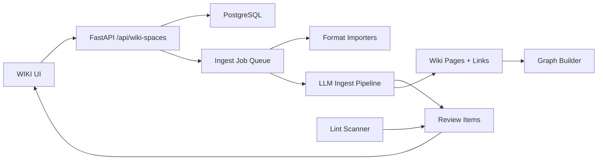

# FeedMind WIKI 能力实施计划

本文档规划三条能力线的完整落地方案：

1. 文件/来源管理闭环
2. Review/Lint UI
3. 多格式导入

目标是在保留 FeedMind 当前 `Next.js + FastAPI + LangGraph Server + PostgreSQL` 架构的前提下，把现有 WIKI 模块从“可摄入、可展示”推进到“可追踪、可修正、可维护、可扩展导入”的知识库工作流。

## 当前基线

当前已经具备：

- WIKI 空间、页面、来源、链接和 embedding 表结构雏形。
- `WikiSource` 创建、列表、删除和异步 ingest 队列。
- 两阶段 ingest：LLM 分析来源，再生成 `FILE` block 并写入 `WikiPage`。
- 基于 `[[wikilink]]` 的链接刷新。
- WIKI 页面列表、来源列表、统计卡片、详情面板、知识图谱展示。
- 图谱权重信号、Louvain 社区发现和基础图谱洞察。

当前缺口：

- 来源和页面之间缺少完整生命周期关系、可重扫、可重试、可取消、可级联删除。
- Review 结果只在后端解析函数层有雏形，没有持久化队列和 UI 处理闭环。
- Lint 还没有系统化规则、定时/手动扫描和修复建议。
- 导入入口仍偏纯文本，缺少 PDF/DOCX/PPTX/XLSX/图片/网页等格式解析流水线。
- ingest 队列是内存级工作流，不适合长任务恢复、进度展示和失败排查。

## 设计原则

- 数据库优先：FeedMind 当前不是文件型 vault，先把来源、页面、任务、问题都建模进数据库。
- 可追溯：任何页面都能回答“来自哪些 source、哪次 ingest、哪段原文、哪次 review/lint 修改”。
- 小步迁移：不推翻现有 `wiki_ingest.py`，先拆出边界，再替换内部实现。
- 人工可控：自动生成的变更必须能预览、重试、跳过、接受或拒绝。
- 格式解析与 LLM 生成解耦：导入器只负责规范化来源，ingest 负责知识生成。

## 总体架构



新增后端模块建议：

- `backend/app/services/wiki_sources.py`：来源增删改查、hash、版本、级联策略。
- `backend/app/services/wiki_jobs.py`：持久化任务、进度、取消、重试。
- `backend/app/services/wiki_importers/`：多格式导入器。
- `backend/app/services/wiki_review.py`：review item 生成、状态迁移、应用动作。
- `backend/app/services/wiki_lint.py`：lint 规则和扫描器。
- `backend/app/services/wiki_ingest.py`：保留生成逻辑，但逐步只负责“规范化来源 -> 页面候选 -> review/page 写入”。

新增前端模块建议：

- `frontend/components/wiki/source-manager-panel.tsx`
- `frontend/components/wiki/ingest-job-panel.tsx`
- `frontend/components/wiki/review-inbox.tsx`
- `frontend/components/wiki/lint-dashboard.tsx`
- `frontend/components/wiki/import-dialog.tsx`

## 一、文件/来源管理闭环

### 成功标准

- 每个 source 有明确状态、内容 hash、版本、导入方式、关联页面和最近任务。
- 用户可以新增、重扫、重试、取消、删除 source。
- 删除 source 时可以选择保留页面、仅移除来源引用、或删除仅由该 source 生成的页面。
- ingest 失败后保留错误、阶段、可重试上下文，不丢失已有页面。
- 前端能展示 source -> pages -> jobs 的完整链路。

### 数据模型

扩展 `WikiSource`：

- `content_hash`：已有，可继续作为去重基础。
- `mime_type`：导入器识别出的 MIME。
- `import_kind`：`text | file | url | clipboard | generated`。
- `original_uri`：本地文件名、URL 或外部来源标识。
- `content_size`：原文长度或文件大小。
- `version`：同一 source 被重扫后的版本号。
- `last_job_id`：最近一次 ingest job。
- `metadata_`：格式解析信息，例如页数、sheet 名、图片数。

新增 `WikiIngestJob`：

- `id`
- `space_id`
- `source_id`
- `job_type`：`import | ingest | reingest | lint | repair`
- `status`：`queued | running | cancel_requested | completed | failed | canceled`
- `stage`：`extracting | analyzing | generating | writing | reviewing`
- `progress_current`
- `progress_total`
- `error_message`
- `started_at`
- `finished_at`
- `metadata_`

新增 `WikiSourcePage` 关联表：

- `source_id`
- `page_id`
- `relation`：`created | updated | cited | removed`
- `job_id`
- `created_at`

用途：避免只靠 `WikiPage.metadata_.sources` 字符串数组做追溯。

### API 设计

新增或增强：

- `GET /api/wiki-spaces/{space_id}/sources`
  - 返回 source 统计、最近任务、关联页面数。
- `POST /api/wiki-spaces/{space_id}/sources`
  - 支持纯文本 source。
- `POST /api/wiki-spaces/{space_id}/sources/imports`
  - multipart 文件导入入口。
- `POST /api/wiki-spaces/{space_id}/sources/{source_id}/ingestions`
  - 启动 ingest 或 reingest。
- `POST /api/wiki-spaces/{space_id}/jobs/{job_id}/cancel`
  - 请求取消。
- `POST /api/wiki-spaces/{space_id}/jobs/{job_id}/retry`
  - 用同一输入重试。
- `DELETE /api/wiki-spaces/{space_id}/sources/{source_id}?mode=detach|delete-orphans|delete-all-created`
  - 明确删除策略。
- `GET /api/wiki-spaces/{space_id}/jobs`
  - 任务列表。
- `GET /api/wiki-spaces/{space_id}/jobs/{job_id}`
  - 任务详情。

### 后端实施步骤

1. 建模和迁移
   - 添加 `WikiIngestJob` 和 `WikiSourcePage`。
   - 扩展 `WikiSource` 字段。
   - 给 `source_id`、`space_id`、`status`、`content_hash` 增加索引。
   - 为现有 source/page 元数据补一段兼容迁移函数。

2. 持久化 job queue
   - 当前 `wiki_ingest_queue.py` 从内存队列升级为数据库队列。
   - worker 轮询 `queued` job，并用事务抢占任务。
   - 每个阶段更新 `stage` 和进度。
   - `cancel_requested` 在阶段边界生效。

3. Source 写入规范化
   - 抽出 `create_or_update_source()`。
   - 同 content hash 默认复用 source。
   - 同 original_uri 但内容变化时递增 version，而不是覆盖历史。

4. 页面写入追溯
   - `_write_blocks()` 写入页面后同步写 `WikiSourcePage`。
   - 页面 metadata 继续保留 `sources`，但作为展示缓存。
   - 删除 source 时根据关联关系计算影响范围。

5. 删除和重扫
   - `detach`：只移除 source 引用，不删页面。
   - `delete-orphans`：删除只由该 source 创建/引用的页面。
   - `delete-all-created`：删除本 source 创建的页面，即使还有其它来源引用，需前端二次确认。
   - 重扫 source 时生成新 job，写入新版本关联。

### 前端实施步骤

1. 改造 `WikiSourceList`
   - 展示状态、文件类型、版本、更新时间、关联页面数、最近 job。
   - 添加操作菜单：查看详情、重新摄入、重试、取消、删除。

2. 新增 source detail drawer
   - 展示原文摘要、metadata、关联页面、任务历史、错误日志。

3. 新增 job panel
   - 顶部或右侧显示运行中任务。
   - 支持取消、重试、跳到 source。

4. 删除确认流
   - 删除前展示影响页面列表。
   - 让用户选择删除策略。

### 测试

- Source hash 去重。
- 同 URI 新版本创建。
- ingest job 状态迁移。
- 取消任务不会写入半成品页面。
- 删除 source 的三种策略。
- 删除后 graph、stats、source list 同步更新。

## 二、Review/Lint UI

### 成功标准

- ingest 和 lint 能产生可持久化 review item。
- 用户可以按类型、严重级别、来源、页面过滤 review item。
- 每个 item 支持接受、拒绝、稍后处理、应用自动修复。
- Lint 可手动运行，后续可定时运行。
- Review/Lint 结果能反向更新页面、链接、source metadata 或任务状态。

### 数据模型

新增 `WikiReviewItem`：

- `id`
- `space_id`
- `source_id`
- `page_id`
- `job_id`
- `kind`：`contradiction | duplicate | missing-page | suggestion | lint`
- `severity`：`info | warning | error`
- `status`：`open | accepted | rejected | snoozed | applied`
- `title`
- `body`
- `evidence`：JSON，保存相关页面、source、文本片段。
- `proposed_action`：JSON，描述可执行动作。
- `resolution`：JSON，保存用户决策。
- `created_at`
- `resolved_at`

新增 `WikiLintRun`：

- `id`
- `space_id`
- `status`
- `rules_enabled`
- `item_count`
- `created_at`
- `finished_at`

### Review 来源

1. Ingest LLM 输出
   - 复用 `parse_review_blocks()`，但不再丢弃结果。
   - `FILE` block 写页面，`REVIEW` block 写 `WikiReviewItem`。

2. 后端规则 lint
   - 无效 frontmatter。
   - 缺少必填字段。
   - `related` 指向不存在页面。
   - `[[wikilink]]` 指向不存在页面。
   - 重复标题或近似标题。
   - orphan 页面。
   - source 引用不存在。
   - 长期 failed/pending source。

3. 图谱 lint
   - 弱连接页面。
   - 低内聚社区。
   - 高桥接节点缺少 synthesis 页面。
   - 跨社区强连接但无解释页。

### API 设计

- `GET /api/wiki-spaces/{space_id}/review-items`
  - query：`status`、`kind`、`severity`、`page_id`、`source_id`。
- `POST /api/wiki-spaces/{space_id}/review-items/{item_id}/accept`
- `POST /api/wiki-spaces/{space_id}/review-items/{item_id}/reject`
- `POST /api/wiki-spaces/{space_id}/review-items/{item_id}/snooze`
- `POST /api/wiki-spaces/{space_id}/review-items/{item_id}/apply`
- `POST /api/wiki-spaces/{space_id}/lint-runs`
  - 手动触发 lint。
- `GET /api/wiki-spaces/{space_id}/lint-runs`
  - 历史记录。

### 自动修复动作

第一阶段只支持安全动作：

- 创建 missing page 草稿。
- 给页面追加/修正 metadata 字段。
- 为孤立页添加 review 建议，不自动改正文。
- 合并重复页只生成建议，不自动合并。

第二阶段再考虑：

- 自动更新 `related`。
- 自动生成 synthesis 页面。
- 自动合并重复页面。

### 前端实施步骤

1. 新增 Review Inbox
   - 位置：WIKI 页面主区域增加 tab，或右侧面板。
   - 列表字段：类型、严重级别、标题、关联页面、来源、状态、时间。
   - 支持批量关闭低风险 info。

2. Review Detail
   - 左侧 evidence，右侧 proposed action。
   - 展示页面片段、source 名称、相关链接。
   - 操作：接受、拒绝、稍后、应用。

3. Lint Dashboard
   - 显示 lint 运行状态、规则分布、问题趋势。
   - “运行检查”按钮触发 lint job。

4. 与图谱联动
   - 图谱 insight 点击后可创建 review item。
   - review item 可高亮相关节点。

### 后端实施步骤

1. 添加 Review/Lint 模型和 schema。
2. 在 ingest 成功后保存 review blocks。
3. 实现基础 lint rules。
4. 实现 apply action dispatcher。
5. 把 lint run 接入 `WikiIngestJob` 或单独运行器。

### 测试

- `parse_review_blocks()` 到 `WikiReviewItem` 的持久化。
- lint 规则逐条单测。
- apply action 的事务一致性。
- reject/accept/snooze 状态迁移。
- 前端 review filter 和操作 API mock 测试。

## 三、多格式导入

### 成功标准

- 用户可以上传常见文件，系统自动提取文本并创建 source。
- 导入器输出统一 `NormalizedSource`，ingest 不关心原始格式。
- 每个 source 保存解析 metadata 和错误信息。
- 支持大文件失败重试，不阻塞其它任务。
- 第一阶段不追求完美版式还原，优先保证内容可摄入和可追溯。

### 统一导入接口

定义 `NormalizedSource`：

```python
class NormalizedSource(BaseModel):
    filename: str
    mime_type: str
    title: str
    text: str
    metadata: dict
    assets: list[NormalizedAsset] = []
```

定义 `NormalizedAsset`：

```python
class NormalizedAsset(BaseModel):
    kind: Literal["image", "table", "attachment"]
    name: str
    content_type: str
    data_ref: str
    caption: str | None = None
    metadata: dict = {}
```

第一阶段 assets 只保存 metadata，不进入多模态检索。后续可以接视觉 caption 和 image embedding。

### 支持格式分期

Phase A：低风险文本格式

- `.txt`
- `.md`
- `.csv`
- `.json`
- `.html`

Phase B：办公文档

- `.pdf`
- `.docx`
- `.pptx`
- `.xlsx`

Phase C：图像与网页

- `.png`
- `.jpg`
- URL 导入
- 浏览器剪藏

### 后端依赖建议

Python 侧：

- PDF：`pymupdf` 或 `pypdf`。优先 `pymupdf`，文本和图片提取能力更完整。
- DOCX：`python-docx`。
- PPTX：`python-pptx`。
- XLSX：`openpyxl`。
- HTML：`beautifulsoup4` + `readabilipy` 或现有 agent readability 思路复用。
- CSV：Python 标准库 `csv`。

注意：新增依赖前先做最小 spike，确认 Windows + uv 环境安装稳定。

### 导入器设计

目录：

```text
backend/app/services/wiki_importers/
├── __init__.py
├── base.py
├── text.py
├── markdown.py
├── html.py
├── pdf.py
├── docx.py
├── pptx.py
├── xlsx.py
└── registry.py
```

接口：

```python
class WikiImporter(Protocol):
    supported_extensions: set[str]
    supported_mime_types: set[str]

    def import_file(self, file: UploadFile) -> NormalizedSource:
        ...
```

`registry.py` 负责根据 extension/MIME 选择导入器。

### 格式处理策略

PDF：

- 提取逐页文本。
- 输出 Markdown：
  - `# filename`
  - `## Page 1`
  - page text
- metadata：页数、是否有图片、是否疑似扫描件。
- 扫描件 OCR 不放第一阶段，可作为后续能力。

DOCX：

- 保留标题层级、段落、列表。
- 表格转 Markdown table。
- metadata：段落数、表格数。

PPTX：

- 每页 slide 转一个 `## Slide N: title`。
- 提取文本框、备注、表格。
- metadata：slide 数。

XLSX：

- 每个 sheet 转一个 section。
- 小表转 Markdown table。
- 大表只保留前 N 行预览 + schema summary，避免 LLM 上下文爆炸。
- metadata：sheet 名、行列数。

HTML/URL：

- 用 readability 提正文。
- 保留原 URL、标题、抓取时间。
- URL 导入先在后端实现，浏览器扩展后置。

图片：

- 第一阶段只创建 source 记录，提示“需要视觉 caption 配置”。
- 第二阶段接视觉模型生成 caption，再把 caption 作为 text source ingest。

### API 设计

- `POST /api/wiki-spaces/{space_id}/sources/imports`
  - multipart：`files[]`
  - 返回 created sources 和 import jobs。
- `POST /api/wiki-spaces/{space_id}/sources/url-imports`
  - body：`url`
  - 抓取网页并创建 source。
- `GET /api/wiki-spaces/{space_id}/imports/capabilities`
  - 前端读取当前支持格式、大小限制。

### 前端实施步骤

1. Import Dialog
   - 拖拽上传。
   - 显示支持格式和大小限制。
   - 上传后显示每个文件的解析状态。

2. Source Preview
   - 上传后先预览规范化文本摘要。
   - 用户可选择“仅保存 source”或“保存并摄入”。

3. URL Import
   - 输入 URL。
   - 后端抓取标题和正文。
   - 显示原始 URL 和抓取结果。

4. 错误体验
   - 文件不支持、解析失败、内容为空、大文件超限分别给明确错误。

### 测试

- 每种 importer 的小样本单测。
- 大文件截断策略测试。
- 空文档、坏文件、密码 PDF 错误测试。
- multipart API 测试。
- 前端上传状态和错误展示测试。

## 推荐里程碑

### Milestone 1：来源闭环基础

范围：

- `WikiIngestJob`
- `WikiSourcePage`
- source 详情 API
- job 状态和重试
- source list UI 改造

验收：

- 用户能看到每个来源关联了哪些页面。
- ingest 失败可重试。
- 删除来源会展示影响范围。

### Milestone 2：Review 持久化和 Inbox

范围：

- `WikiReviewItem`
- 保存 ingest review blocks。
- Review Inbox UI。
- accept/reject/snooze 状态迁移。

验收：

- LLM 输出的 review 不再丢失。
- 用户能处理 review item。

### Milestone 3：基础 Lint

范围：

- lint run 模型。
- frontmatter、wikilink、orphan、source 引用规则。
- Lint Dashboard。

验收：

- 用户能手动运行 lint。
- lint 结果进入 Review Inbox。

### Milestone 4：多格式导入 Phase A/B

范围：

- importer registry。
- TXT/MD/CSV/HTML。
- PDF/DOCX/PPTX/XLSX。
- Import Dialog。

验收：

- 常见文档能上传、解析、生成 source、进入 ingest。

### Milestone 5：维护闭环增强

范围：

- 自动修复动作。
- source 重扫版本。
- 图谱 insight 创建 review。
- URL 导入。

验收：

- 从发现问题到修正页面有闭环。
- WIKI 维护不再只依赖人工读页面。

## 风险与取舍

- 多格式解析容易拖大范围。第一阶段只做“文本可摄入”，不做完美版式还原。
- 自动修复容易误伤知识库。先做 review item 和可预览 action，再做自动应用。
- 持久化队列会引入并发复杂度。先单 worker + 数据库锁，后续再扩展多 worker。
- 文件型 vault 和数据库型 WIKI 是两种路线。当前计划选择数据库型，暂不追求 Obsidian 兼容。
- OCR、图片 caption、音视频转写价值高但成本也高，应放在多格式导入稳定之后。

## 需要避免的实现方式

- 不要把导入器逻辑塞进 `wiki.py` 路由。
- 不要让前端直接推断 job 状态，状态应由后端返回。
- 不要只靠页面 metadata 维护 source 关系，必须有关系表。
- 不要一开始自动合并/删除页面，破坏性动作必须有人确认。
- 不要让 importer 直接调用 LLM，格式解析和知识生成要分层。

## 最小可行切入点

建议从 Milestone 1 开始：

1. 添加 `WikiIngestJob`。
2. 当前内存队列改为创建 job，再由 worker 消费。
3. 写入页面时记录 `WikiSourcePage`。
4. 前端 source 列表展示“最近任务”和“关联页面”。

这一步不需要引入新文件解析依赖，也不需要重写 ingest prompt，但能立刻补上后续 Review/Lint/多格式导入都依赖的追溯骨架。
